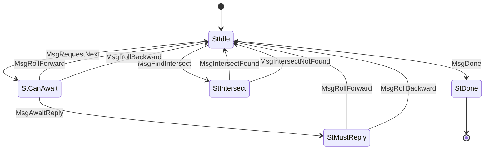

# ChainSync (Protocol ID 2)

Follow the chain tip. Client requests headers one at a time; server streams them with rollback support. Fork recovery via intersection finding — client provides known points, server finds the most recent common ancestor.

## Files

| File | Description |
|------|-------------|
| `mod.rs` | State machine (`State`, `Message`), `Protocol` impl, client helpers |
| `codec.rs` | CBOR encode/decode for ChainSync messages |

## State Machine

## Agency Table

| State | Agency | Message | Next State |
|-------|--------|---------|------------|
| StIdle | **Client** | MsgRequestNext | StCanAwait |
| StIdle | **Client** | MsgFindIntersect(points) | StIntersect |
| StIdle | **Client** | MsgDone | StDone |
| StCanAwait | **Server** | MsgAwaitReply | StMustReply |
| StCanAwait | **Server** | MsgRollForward(header, tip) | StIdle |
| StCanAwait | **Server** | MsgRollBackward(point, tip) | StIdle |
| StMustReply | **Server** | MsgRollForward(header, tip) | StIdle |
| StMustReply | **Server** | MsgRollBackward(point, tip) | StIdle |
| StIntersect | **Server** | MsgIntersectFound(point, tip) | StIdle |
| StIntersect | **Server** | MsgIntersectNotFound(tip) | StIdle |
| StDone | Nobody | — | — |

## Limits

- **Max message size**: 65,535 bytes
- **Ingress limit**: 462,000 bytes
- **Timeouts**: idle 3,673s, can-await 10s, must-reply 756s, intersect 10s

## Client Helpers

- `find_intersection(runner, points) -> Result<(Point, Tip)>` — send known points, get best intersection
- `request_next(runner) -> Result<ChainSyncEvent>` — get next header or rollback notification
- `ChainSyncEvent` enum: `RollForward { header, tip }`, `RollBackward { point, tip }`, `Await`
