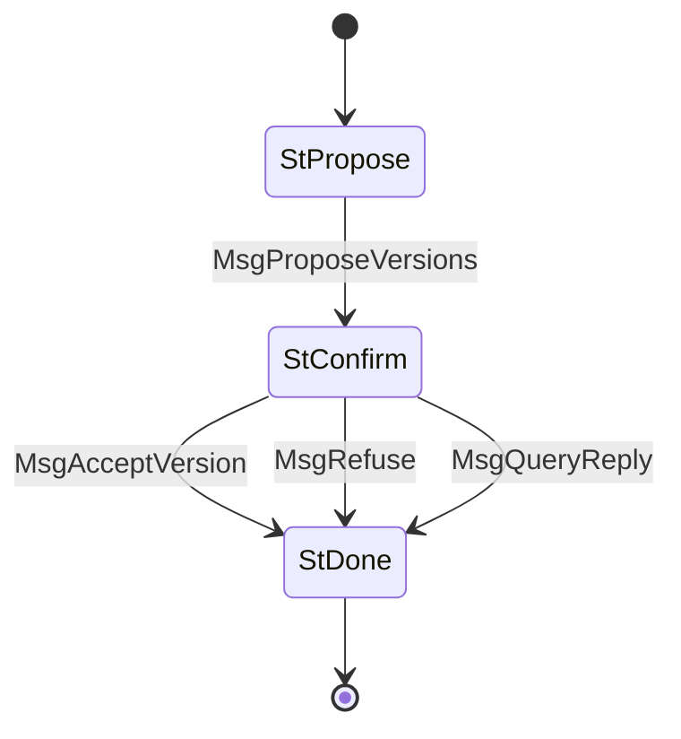

# Handshake (Protocol ID 0)

Version negotiation at connection startup. Client proposes a version table; server accepts one version or refuses. Always the first protocol to run on a new connection.

## Files

| File | Description |
|------|-------------|
| `mod.rs` | State machine (`State`, `Message`), `Protocol` impl, client/server entry points |
| `codec.rs` | CBOR encode/decode for handshake messages |
| `n2n.rs` | N2N version data: `VersionTable`, `VersionData`, magic constants, CBOR codec |

## State Machine

## Agency Table

| State | Agency | Message | Next State |
|-------|--------|---------|------------|
| StPropose | **Client** | MsgProposeVersions(version_table) | StConfirm |
| StConfirm | **Server** | MsgAcceptVersion(version, params) | StDone |
| StConfirm | **Server** | MsgRefuse(reason) | StDone |
| StConfirm | **Server** | MsgQueryReply(version_table) | StDone |
| StDone | Nobody | — | — |

## Limits

- **Max message size**: 5,760 bytes
- **Timeout**: 10s (all states)

## Entry Points

- `run_client(codec_send, codec_recv, versions) -> Result<(u64, Vec<u8>)>` — propose versions, return accepted version + params
- `run_server(codec_send, codec_recv, versions) -> Result<(u64, Vec<u8>)>` — receive proposals, accept best match or refuse
