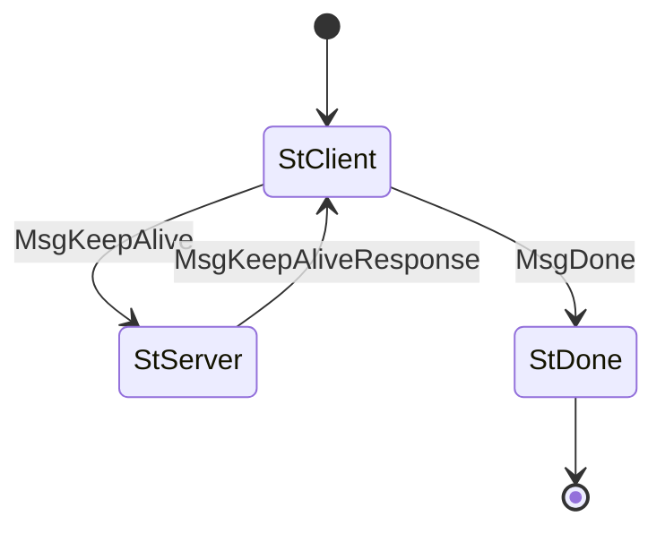

# KeepAlive (Protocol ID 8)

Simple ping/pong for liveness detection and RTT measurement. Client sends a cookie; server echoes it back. Used by the coordinator to measure per-peer latency for smart fetch routing.

## Files

| File | Description |
|------|-------------|
| `mod.rs` | State machine (`State`, `Message`), `Protocol` impl, `keep_alive` helper |
| `codec.rs` | CBOR encode/decode for KeepAlive messages |

## State Machine

## Agency Table

| State | Agency | Message | Next State |
|-------|--------|---------|------------|
| StClient | **Client** | MsgKeepAlive(cookie) | StServer |
| StClient | **Client** | MsgDone | StDone |
| StServer | **Server** | MsgKeepAliveResponse(cookie) | StClient |
| StDone | Nobody | — | — |

## Limits

- **Max message size**: 65,535 bytes
- **Ingress limit**: 1,408 bytes
- **Timeouts**: client 97s, server 60s

## Client Helper

- `keep_alive(runner) -> Result<Duration>` — send ping, wait for pong, return RTT
