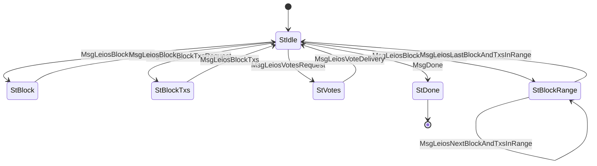

# LeiosFetch (Protocol ID 19) — CIP-0164

Client-driven request/response for Leios data retrieval. Supports fetching individual endorser blocks (EBs), selective transaction fetching via bitmap addressing, vote batches, and block range streaming. Complements [LeiosNotify](../leios_notify/) which provides the offers.

## Files

| File | Description |
|------|-------------|
| `mod.rs` | State machine (`State`, `Message`), `Protocol` impl |
| `codec.rs` | CBOR encode/decode for LeiosFetch messages |

## State Machine

## Agency Table

| State | Agency | Message | Next State |
|-------|--------|---------|------------|
| StIdle | **Client** | MsgLeiosBlockRequest(slot, hash) | StBlock |
| StIdle | **Client** | MsgLeiosBlockTxsRequest(slot, hash, bitmap) | StBlockTxs |
| StIdle | **Client** | MsgLeiosVotesRequest(votes) | StVotes |
| StIdle | **Client** | MsgLeiosBlockRangeRequest(start_slot, end_slot, start_hash, end_hash) | StBlockRange |
| StIdle | **Client** | MsgDone | StDone |
| StBlock | **Server** | MsgLeiosBlock(block) | StIdle |
| StBlockTxs | **Server** | MsgLeiosBlockTxs(transactions) | StIdle |
| StVotes | **Server** | MsgLeiosVoteDelivery(votes) | StIdle |
| StBlockRange | **Server** | MsgLeiosNextBlockAndTxsInRange(block, txs) | StBlockRange |
| StBlockRange | **Server** | MsgLeiosLastBlockAndTxsInRange(block, txs) | StIdle |
| StDone | Nobody | — | — |

## Limits

- **Max message size**: 65,535 bytes (idle), 16,777,216 bytes (data states, 16MB)
- **Ingress limit**: 16,777,216 bytes
- **Max bitmap entries**: 1,024
- **Max transactions**: 65,536
- **Max votes**: 1,024
- **Timeout**: server states 120s (large transfers)

## Bitmap TX Addressing

`MsgLeiosBlockTxsRequest` carries a `BTreeMap<u16, u64>` bitmap for selective transaction fetching. Each entry maps a 16-bit segment index to a 64-bit bitmask, allowing the client to request specific transactions from an EB without downloading the entire set. This is critical for bandwidth efficiency when a node already has most transactions from prior dissemination.
