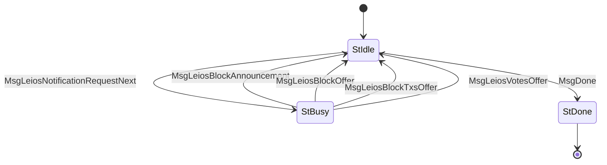

# LeiosNotify (Protocol ID 18) — CIP-0164

Client-driven polling for Leios data announcements. Server notifies the client about available endorser blocks (EBs), EB transactions, and votes. The client uses these offers to decide what to fetch via [LeiosFetch](../leios_fetch/).

## Files

| File | Description |
|------|-------------|
| `mod.rs` | State machine (`State`, `Message`), `Protocol` impl, `LeiosNotifyEvent` helper enum |
| `codec.rs` | CBOR encode/decode for LeiosNotify messages |

## State Machine

## Agency Table

| State | Agency | Message | Next State |
|-------|--------|---------|------------|
| StIdle | **Client** | MsgLeiosNotificationRequestNext | StBusy |
| StIdle | **Client** | MsgDone | StDone |
| StBusy | **Server** | MsgLeiosBlockAnnouncement(header) | StIdle |
| StBusy | **Server** | MsgLeiosBlockOffer(slot, hash) | StIdle |
| StBusy | **Server** | MsgLeiosBlockTxsOffer(slot, hash) | StIdle |
| StBusy | **Server** | MsgLeiosVotesOffer(votes) | StIdle |
| StDone | Nobody | — | — |

## Limits

- **Max message size**: 65,535 bytes
- **Ingress limit**: 65,536 bytes
- **Max votes per offer**: 1,024
- **Timeout**: busy 60s

## Messages

- **MsgLeiosBlockAnnouncement** — RB header that announces an EB (carries the EB hash in CIP-0164 header extension)
- **MsgLeiosBlockOffer** — an EB is available for fetching (slot + hash)
- **MsgLeiosBlockTxsOffer** — an EB's transactions are available (slot + hash)
- **MsgLeiosVotesOffer** — a batch of votes is available (list of `(slot, voter_id)` keys)

## Client Helper

- `request_next(runner) -> Result<LeiosNotifyEvent>` — poll for next notification
- `LeiosNotifyEvent` enum: `BlockAnnouncement`, `BlockOffer`, `BlockTxsOffer`, `VotesOffer`
