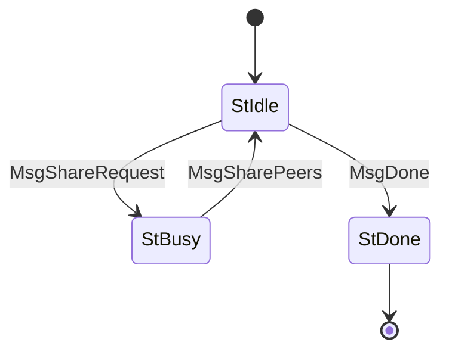

# PeerSharing (Protocol ID 10)

Peer discovery. Client requests N peers; server returns a list of IPv4/IPv6 addresses. Used to bootstrap and expand the peer set without relying on centralized registries.

## Files

| File | Description |
|------|-------------|
| `mod.rs` | State machine (`State`, `Message`), `Protocol` impl, `PeerAddress` type |
| `codec.rs` | CBOR encode/decode for PeerSharing messages |

## State Machine

## Agency Table

| State | Agency | Message | Next State |
|-------|--------|---------|------------|
| StIdle | **Client** | MsgShareRequest(amount) | StBusy |
| StIdle | **Client** | MsgDone | StDone |
| StBusy | **Server** | MsgSharePeers(peers) | StIdle |
| StDone | Nobody | — | — |

## Limits

- **Max message size**: 5,760 bytes
- **Ingress limit**: 5,760 bytes
- **Timeout**: busy 60s
- **Max peers per request**: 255

## Key Types

- `PeerAddress` enum: `IPv4 { addr: [u8; 4], port: u16 }` or `IPv6 { addr: [u8; 16], port: u16 }`
