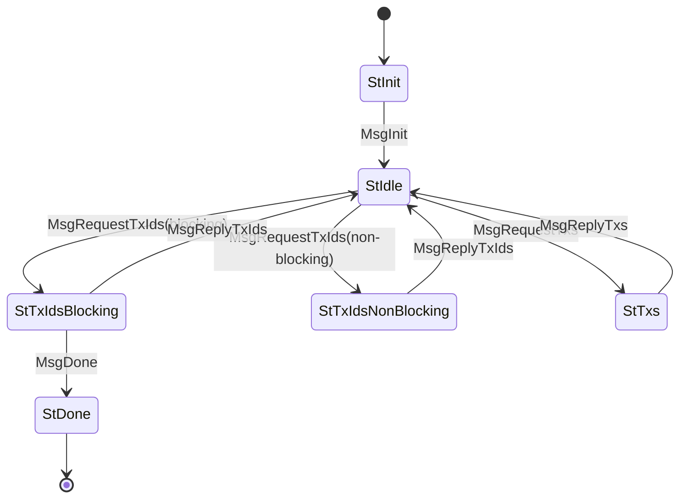

# TxSubmission (Protocol ID 4)

Pull-based transaction dissemination. The server drives the protocol: it requests TX IDs from the client, then selectively requests full TX bodies. Supports blocking (wait for new TXs) and non-blocking (return immediately) request modes.

## Files

| File | Description |
|------|-------------|
| `mod.rs` | State machine (`State`, `Message`), `Protocol` impl, opaque types (`TxId`, `TxBody`, `TxIdAndSize`) |
| `codec.rs` | CBOR encode/decode for TxSubmission messages |

## State Machine

## Agency Table

| State | Agency | Message | Next State |
|-------|--------|---------|------------|
| StInit | **Client** | MsgInit | StIdle |
| StIdle | **Server** | MsgRequestTxIds(blocking, ack, req) | StTxIdsBlocking |
| StIdle | **Server** | MsgRequestTxIds(non-blocking, ack, req) | StTxIdsNonBlocking |
| StIdle | **Server** | MsgRequestTxs(tx_ids) | StTxs |
| StTxIdsBlocking | **Client** | MsgReplyTxIds(ids_and_sizes) | StIdle |
| StTxIdsBlocking | **Client** | MsgDone | StDone |
| StTxIdsNonBlocking | **Client** | MsgReplyTxIds(ids_and_sizes) | StIdle |
| StTxs | **Client** | MsgReplyTxs(bodies) | StIdle |
| StDone | Nobody | — | — |

## Limits

- **Max message size**: 5,760 bytes (init/idle), 2,500,000 bytes (tx states)
- **Timeouts**: non-blocking 10s, txs 10s
- **Flow control**: max 10 unacked TX IDs (`MAX_UNACKED`)

## Key Types

- `TxId(Vec<u8>)` — opaque transaction identifier
- `TxBody(Vec<u8>)` — opaque transaction body
- `TxIdAndSize { id: TxId, size: u32 }` — TX ID with advertised size
