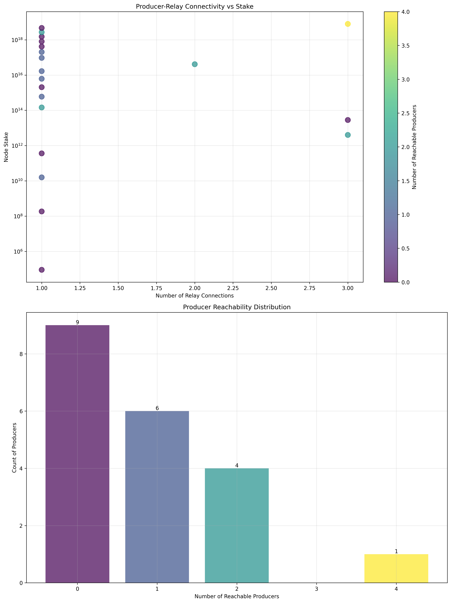
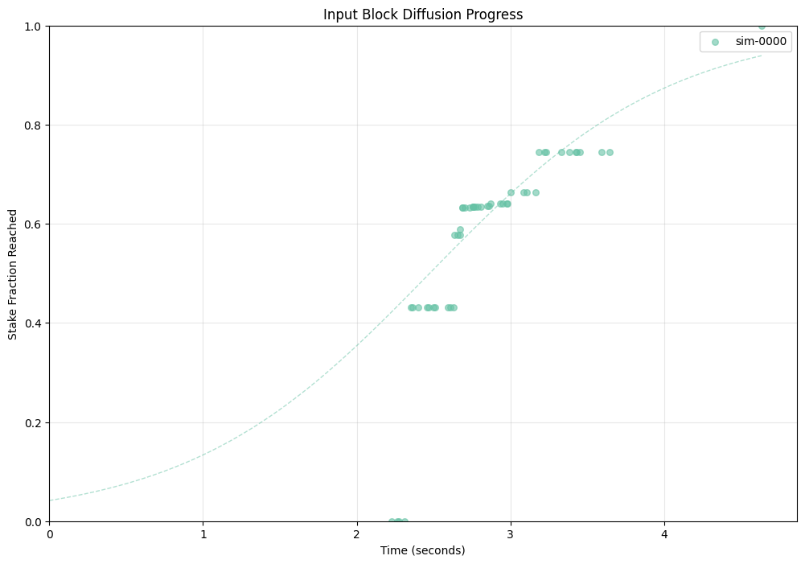
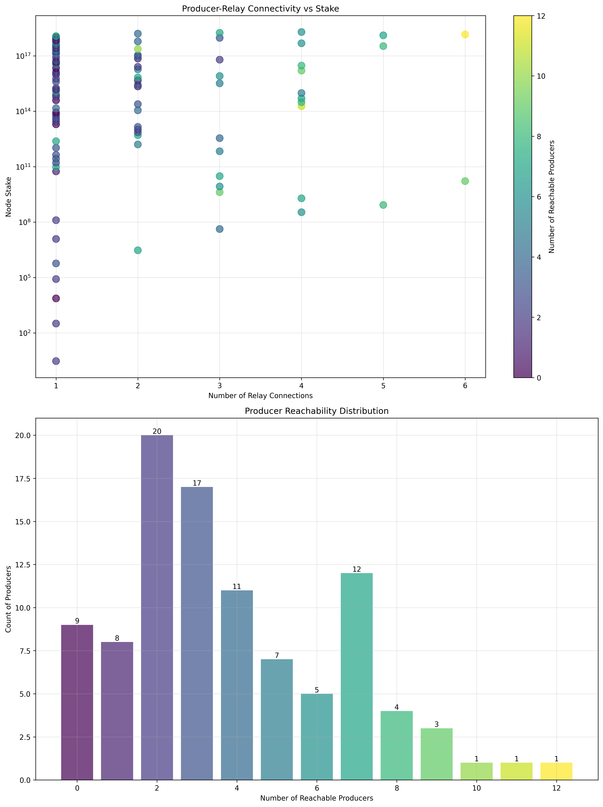
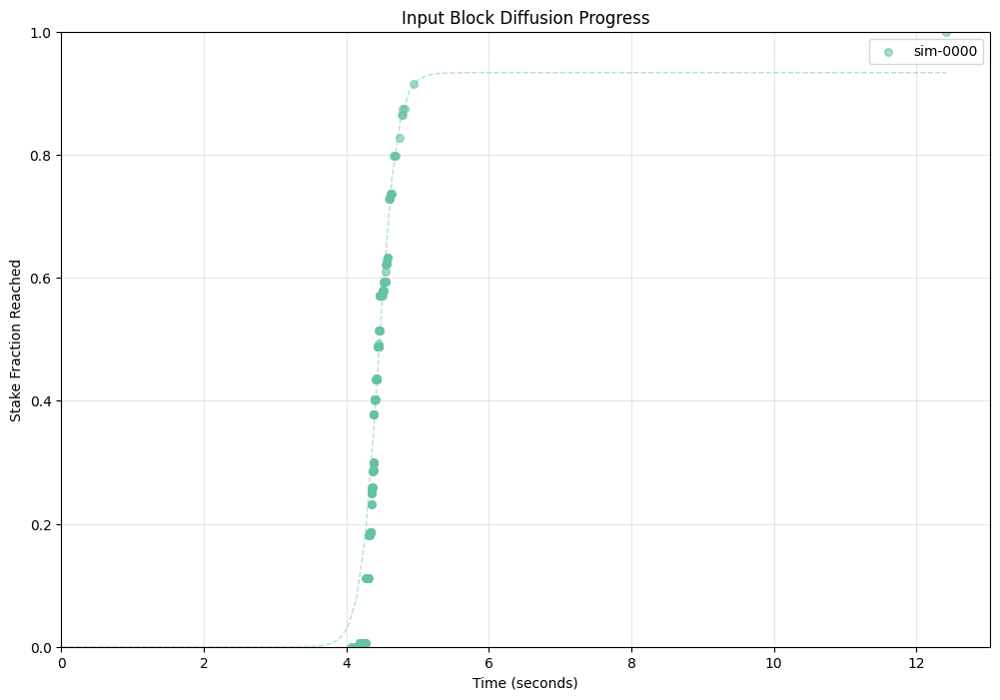
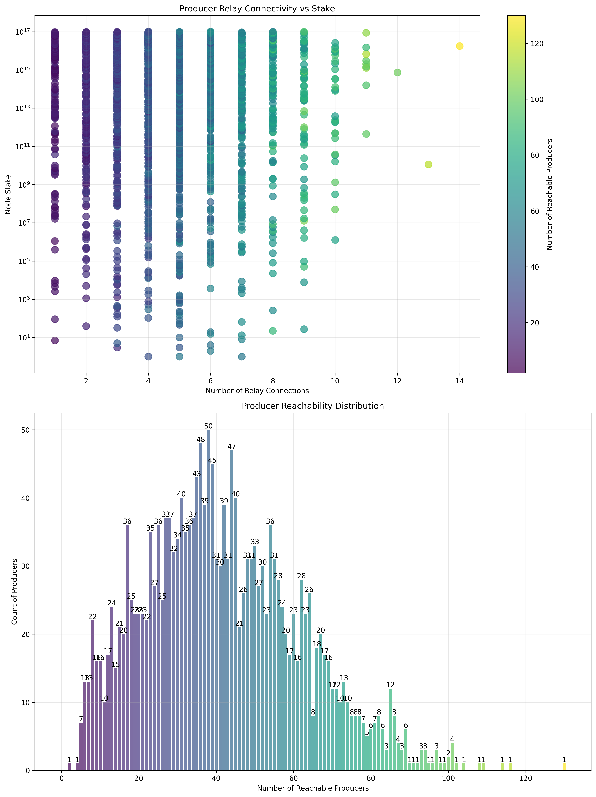
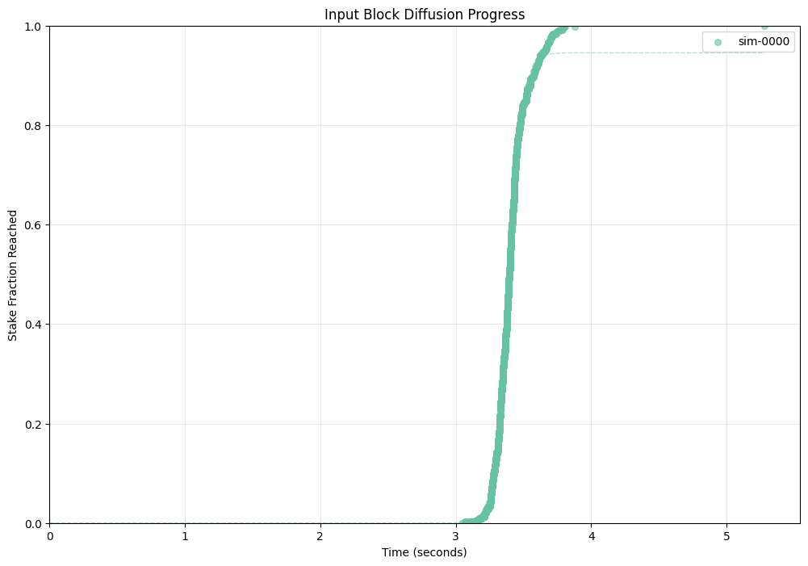
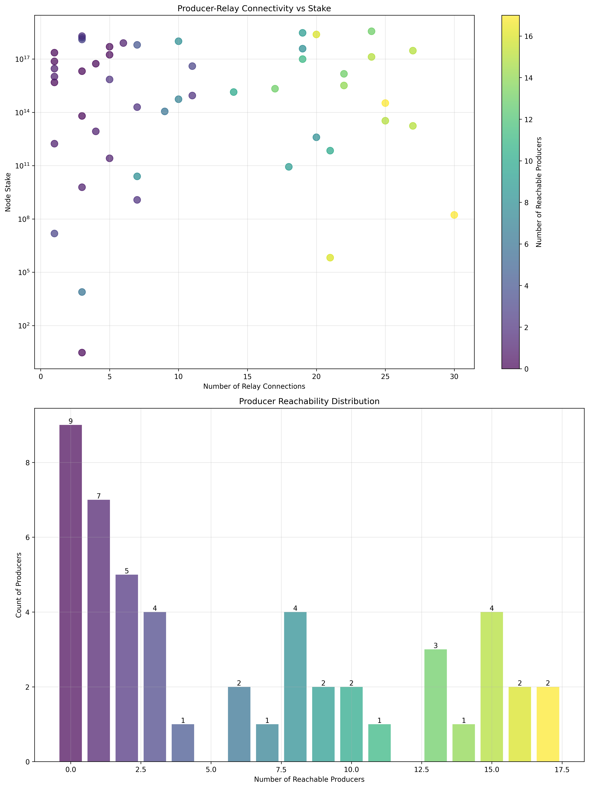
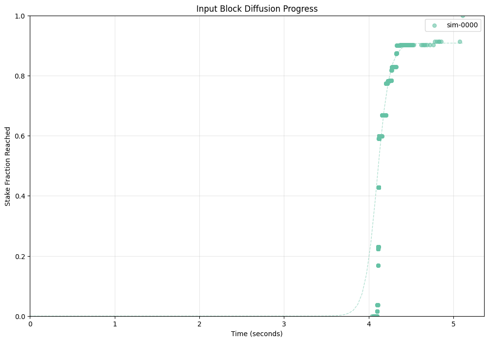

# Network Topology Analysis Examples

This directory contains example network topology configurations and their
analysis results. Each configuration demonstrates different aspects of network
behavior and performance at various scales.

## Small Network (25 nodes)

A compact network configuration ideal for quick testing and development:

- 10 relay nodes forming a resilient backbone
- 15 producer nodes with exponential stake distribution
- Maintains realistic connectivity patterns while being easy to analyze

Network Analysis Summary

See [small/topology_issues.md](small/topology_issues.md) for detailed metrics
and analysis.

## Medium Network

A moderate-sized network with balanced characteristics:

- Mix of relay and producer nodes
- Representative stake distribution
- Typical network connectivity patterns

Network Analysis Summary

See [medium/topology_issues.md](medium/topology_issues.md) for detailed metrics
and analysis.

## Realistic Network

A large-scale network configuration modeling real-world conditions:

- Production-like stake distribution
- Complex relay network topology
- Geographic node distribution considerations

Network Analysis Summary

See [realistic/topology_issues.md](realistic/topology_issues.md) for detailed
metrics and analysis.

## Thousand-Node Network

A high-scale test configuration for performance analysis:

- 1000+ nodes for scalability testing
- Complex stake distribution patterns
- Dense interconnection topology

Network Analysis Summary

See [thousand/topology_issues.md](thousand/topology_issues.md) for detailed
metrics and analysis.

## Understanding the Visualizations

### Topology Metrics Plot

- Node size represents stake (larger = higher stake)
- Node color indicates connectivity (darker = more connections)
- Edge thickness shows connection strength
- Relay nodes (no stake) shown in gray

### Input Block Diffusion Plot

- X-axis: Time steps
- Y-axis: Block propagation percentage
- Each line represents a different input block
- Steeper slopes indicate faster network propagation

### Topology Issues Report

Each `topology_issues.md` file contains:

- Network overview statistics
- Identification of problematic nodes
- Detailed connectivity metrics
- Stake distribution analysis
- Recommendations for topology improvements
