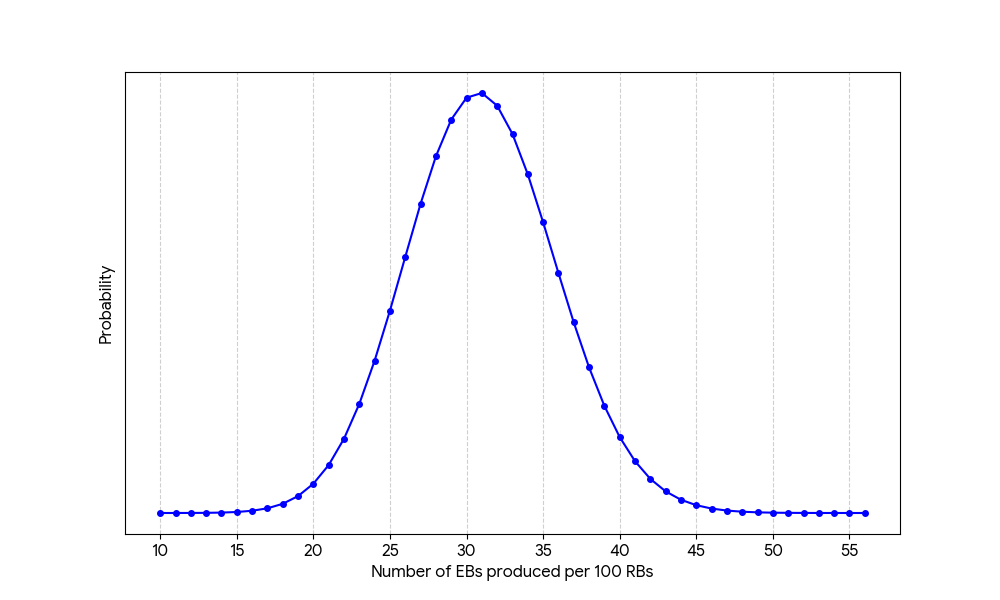
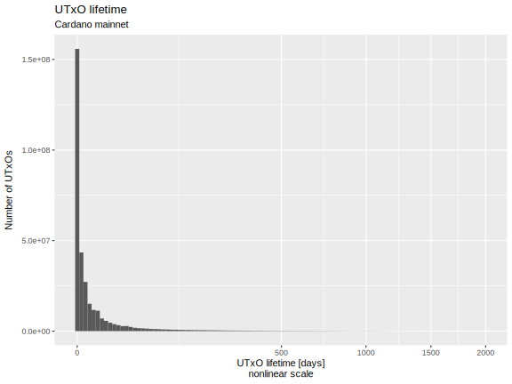
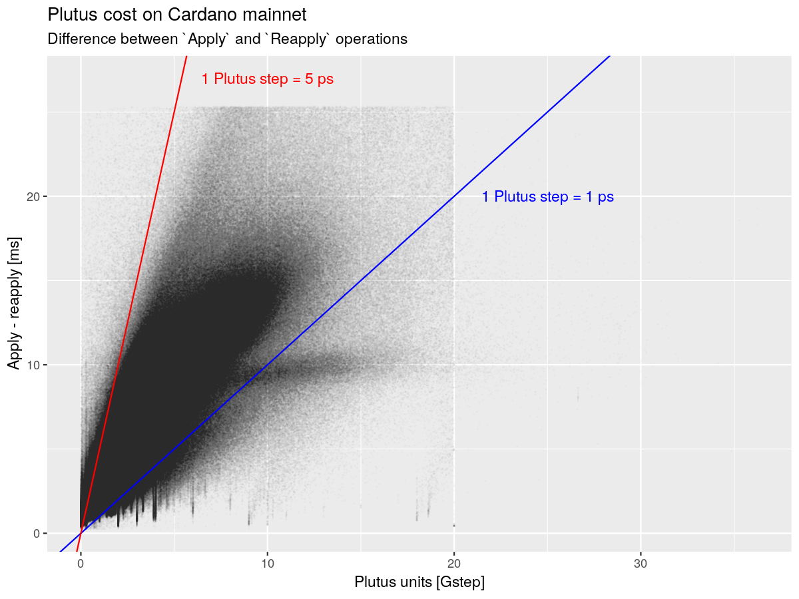
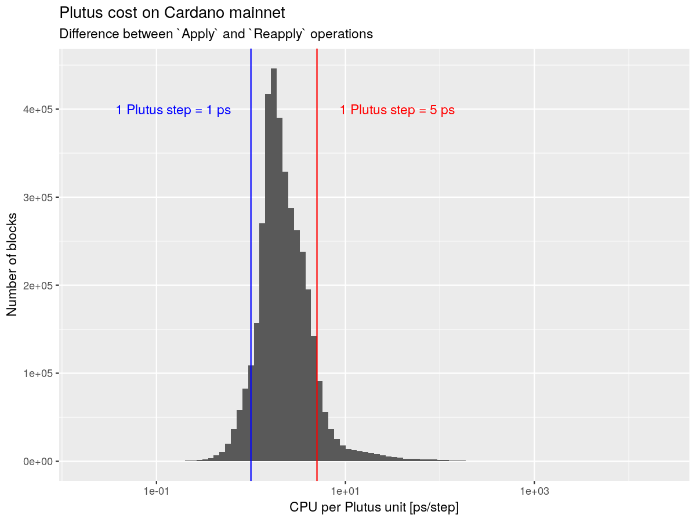

# Post-CIP R&D Findings

This document catalogs Leios-related findings and artifacts that were created subsequent to the [Leios CIP](https://github.com/cardano-foundation/CIPs/pull/1078).

1. [Markovian model of Linear Leios](#markovian-model-of-linear-leios)
2. [Analysis of UTxO set size and UTxO lifetime](#analysis-of-utxo-set-size-and-utxo-lifetime)
3. [CPU cost of `Apply`, `Reapply`, and Plutus ledger operations](#analysis-of-utxo-set-size-and-utxo-lifetime)

---

## Markovian model of Linear Leios

[Markovian simulation of Linear Leios](../analysis/markov/) computes the probability of EB certifications as RBs are produced.

The protocol state is represented by three quantities.

- The number of RBs that have been produced.
- The number of EBs that have been produced.
- Whether an honest RB was produced.
- Whether a certificate is ready for inclusion in the next RB.

Time is tracked in terms of block-forging opportunities instead of in terms of slots.

Transitions occur in several substeps:

1. _Forge RB:_ create a new RB.
2. _Certify:_ include a certificate in the RB.
3. _Forge EB:_ create a new EB.
4. _Vote:_ cast votes to reach a quorum.

The `linleios` program executes the Markov model for EB production in Linear Leios. The protocol parameters and network characteristic are specified as flags on the command line. The program outputs the following information:

- The efficiencies, on `/dev/stdout`.
    - RB efficiency: the fraction of possible RBs that were actually produced.
    - EB efficiency: the fraction of possible EBs that were actually produced.
    - Efficiency: the fraction o possible payload bytes that were actual produced.
- The "missing probability" resulting from the finite-resolution arithmetic of the computations, on `/dev/stderr`.
- Optionally, a JSON file containing the probabilities of the given number of certified EBs.

The figure below shows example results for the probability distribution of the number of EBs generated per 100 RBs. This directly relates to Leios efficiency.

---

## Analysis of UTxO set size and UTxO lifetime

[Analysis of Cardano mainnet](../post-cip/tx-lifetime/tx-lifetime.ipynb) indicates that the number of active UTxOs has leveled off at approximately 11 million unspent transaction outputs. The data likely is not sufficient to build a statistical model to forecast the size of the UTxO set as a function of demand: a more speculative model would be needed.

In terms of lifetime, UTxOs have a trimodal distribution:
- About 3% of UTxOs are spent in the same block that they are created.
- About 65% of the UTxOs are active less than one day.
- The remainder are active for multiple days, sometimes for months or years.

The left plot is on a square-root scale horizontally, so one can see how big the dynamic range of lifetimes is; it also includes the 3.0% of txs that are spent in the same block that they are created. The right plot is the same data on a logarithmic scale (omitting zero lifetime), so that one can see the multimodal structure above and below the one-day lifetime.

|                                                                                                                 |                                                                                                                  |
| --------------------------------------------------------------------------------------------------------------- | ---------------------------------------------------------------------------------------------------------------- |
|  |  |

---

## CPU cost of `Apply`, `Reapply`, and Plutus ledger operations

The Jupyter notebook [post-cip/apply-reapply/analysis.ipynb](../post-cip/apply-reapply/analysis.ipynb) analyzes `db-analyser` measurements for Cardano `mainnet`. Linear models and quantile regressions were applied to the dataset in order to estimate how CPU resources scale with block size, transaction count, number of transaction inputs, and number of Plutus steps. These results can be used for reasoning about feasible values of Leios protocol parameters.

Regarding Plutus, nominally, one step unit corresponds to one picosecond on the benchmark machine and one memory unit corresponds to eight bytes allocated on that machine. The following plots show the relationship between execution steps and CPU on the machine where the `db-analyser` experiment was conducted.

| Plutus steps vs CPU usage                                                                 | CPU usage per Plutus step                                                               |
| ----------------------------------------------------------------------------------------- | --------------------------------------------------------------------------------------- |
|  |  |

The db-analyser is very noisy and hard to fit. Nevertheless, here are the best fits obtained using linear models and the quantile regression. Note that the quantile regression was based on a random subset of the data because it is not computationally feasible to perform quantile regression on such a large dataset in a reasonable amount of time.

| Regression      | Dependent variable |   Block size | Number of transactions | Number of transaction inputs | Number of Plutus steps |
| --------------- | ------------------ | -----------: | ---------------------: | ---------------------------: | ---------------------: |
| Simple ratio    | `Apply - Reapply`  |              |                        |                              |          `1.5 ps/step` |
| Linear model    | `Apply - Reapply`  | `4.7e4 ps/B` |          `1.2e8 ps/tx` |              `8.0e3 ps/txin` |         `0.61 ps/step` |
|                 | `Reapply`          | `2.8e3 ps/B` |          `3.5e7 ps/tx` |              `5.2e6 ps/txin` |                        |
|                 | `Apply`            | `4.8e4 ps/B` |          `1.6e8 ps/tx` |              `1.3e7 ps/txin` |         `0.63 ps/step` |
| 75th percentile | `Apply - Reapply`  | `1.6e4 ps/B` |          `1.7e8 ps/tx` |              `1.8e7 ps/txin` |         `0.96 ps/step` |
|                 | `Reapply`          | `1.7e3 ps/B` |          `4.2e7 ps/tx` |              `5.7e6 ps/txin` |                        |
|                 | `Apply`            | `1.6e4 ps/B` |          `2.2e8 ps/tx` |              `2.3e7 ps/txin` |         `0.97 ps/step` |

Coarsely, the "one picosecond per Plutus step" is a reasonable estimate for Plutus costs; we did not assess whether "eight bytes per Plutus memory unit" was also reasonable.

---
