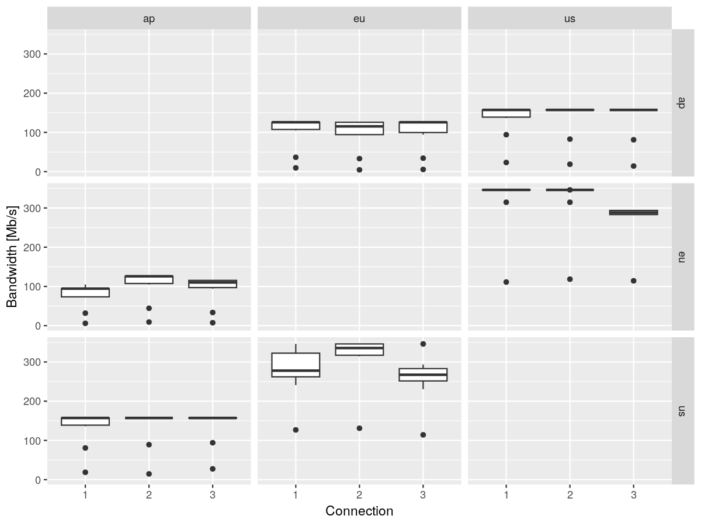
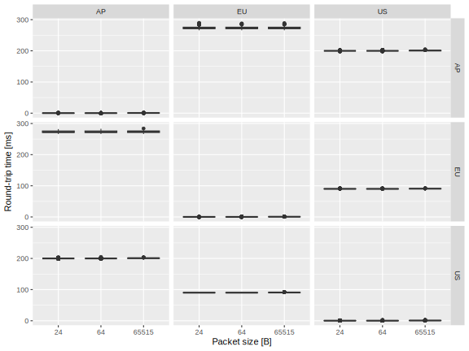
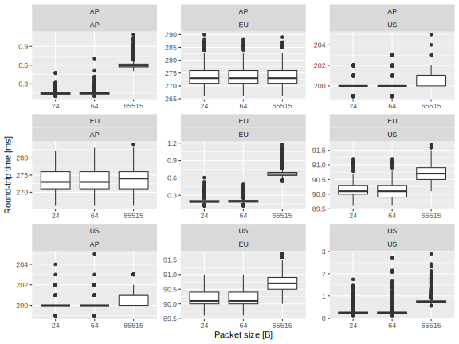

# Bandwidth and latency estimates

### Benchmarking cluster

#### Bandwidth

The Cardano Node benchmarking team kindly provided bandwidth measurements (using `iperf3`) for data centers on three continents.

#### Latencies

The Cardano Node benchmarking team kindly provided latency measurements (using `ping`) for data centers on three continents.

##### Overview

##### Detail

## Inter-datacenter bandwidth for common cloud providers

Because bandwidth between nodes has been identified as a critical resource that limits Leios throughput, we conducted an unscientific experiment, using `iperf3` for bidirectional measurements between locations in North America and Europe:

| Client                   | Server             | Send Mbps | Receive Mbps |
|:-------------------------|:-------------------|----------:|-------------:|
| OVH Canada               | OVH Poland         |       219 |          217 |
| OVH Canada               | OVH Oregon USA     |       363 |          360 |
| OVH Oregon USA           | OVH Poland         |       142 |          144 |
| CenturyLink Colorado USA | OVH Poland         |       147 |          145 |
| CenturyLink Colorado USA | OVH Oregon USA     |       418 |          412 |
| CenturyLink Colorado USA | OVH Canada         |        97 |           95 |
| CenturyLink Colorado USA | OVH Virginia       |       311 |          309 |
| CenturyLink Colorado USA | AWS Oregon USA     |       826 |          824 |
| AWS Oregon USA           | OVH Oregon USA     |       973 |          972 |
| AWS Oregon USA           | OVH Poland         |       141 |          138 |
| AWS Oregon USA           | OVH Canada         |       329 |          327 |
| OVH Virginia USA         | OVH Oregon USA     |       369 |          367 |
| OVH Virginia USA         | OVH Poland         |       231 |          229 |
| OVH Virginia USA         | OVH Canada         |       469 |          467 |
| CenturyLink Colorado USA | OVH United Kingdom |       183 |          181 |
| AWS Oregon USA           | OVH United Kingdom |       153 |          150 |
| OVH Oregon USA           | OVH United Kingdom |       164 |          162 |
| OVH Virginia USA         | OVH United Kingdom |       310 |          308 |
| OVH Poland               | OVH United Kingdom |       355 |          352 |
| OVH Canada               | OVH United Kingdom |       307 |          305 |
| OVH France               | OVH United Kingdom |       373 |          371 |
| CenturyLink Colorado USA | OVH United Kingdom |       166 |          163 |
| AWS Oregon USA           | OVH France         |       138 |          136 |
| OVH Oregon USA           | OVH France         |       182 |          179 |
| OVH Virginia USA         | OVH France         |       290 |          288 |
| OVH Poland               | OVH France         |       918 |          915 |
| OVH Canada               | OVH France         |       304 |          301 |

The OVH machines are inexpensive instances, the AWS is a `r5a.4xlarge`, and CenturyLink is a local ISP. Overall, it looks like 100 Mbps is a conservative lower bound.

## RIPE Atlas ping dataset

[RIPE Atlas](https://atlas.ripe.net/) uses a global network of probes to measure metrics like latencies between machines scattered on the internet. We downloaded a snapshot of this dataset and examine the `ping` latencies.

### Inter-ASN

### Inter-country

### Intra-ASN

| Observations |    RTT mean | RTT standard deviation | RTT minimum | RTT maximum |
| -----------: | ----------: | ---------------------: | ----------: | ----------: |
|  145,057,189 | 80.41246 ms |            103.5428 ms |        0 ms | 249625.7 ms |

## Analysis from Gemini Pro[^1]

[^1]: The response was independently checked with Kagi.

### Prompt

> Write a summary of data and recommendations for typical and conservative values for bandwidth between cloud datacenters from common providers, as a function of "distance" (e.g., whether the data centers are on the same continent).

### Response

Network bandwidth between cloud datacenters is rarely limited by the physical fiber capacity between locations, but rather by **software-defined caps**, **protocol limitations** (specifically TCP physics), and **instance sizing**.

The following summary provides typical and conservative throughput values you can expect between major providers (AWS, Azure, GCP) based on distance.

#### Bandwidth vs. Distance

| **Distance / Scope**    | **Scenario**                                | **Typical Bandwidth (Optimized/Parallel)** | **Conservative Bandwidth (Single-thread/Default)** | **Latency (RTT)** |
| ----------------------- | ------------------------------------------- | ------------------------------------------ | -------------------------------------------------- | ----------------- |
| **Same Region**         | Inter-AZ (Availability Zone)                | **25 - 100 Gbps**                          | **5 - 10 Gbps**                                    | < 2 ms            |
| **Same Continent**      | Inter-Region (e.g., US-East to US-West)     | **1 - 5 Gbps**                             | **40 - 100 MB/s** (300-800 Mbps)                   | 60 - 100 ms       |
| **Different Continent** | Inter-Continental (e.g., US to Europe/Asia) | **500 Mbps - 2 Gbps**                      | **5 - 20 MB/s** (40-160 Mbps)                      | 150 - 300 ms      |

#### Detailed Breakdown by Distance

##### 1. Same Continent (Inter-Region)

- **Context:** Data traveling between regions on the same landmass (e.g., Virginia to Oregon, or Frankfurt to Dublin).
- **The Reality:** Major cloud providers own massive private fiber backbones. The "pipe" is huge, but they throttle it per-connection to ensure fairness.
- **Typical Values (1-5 Gbps):** You can achieve this using modern instance types (e.g., AWS `c5n` or Azure Accelerated Networking enabled VMs) and—crucially—**multi-threaded transfer tools** (like `aws s3 cp` with concurrency or `rclone`).
- **Conservative Values (300-800 Mbps):** If you run a standard file copy (like `scp` or a single HTTP request), you will hit a wall defined by the **Bandwidth-Delay Product**. Even if the line is 10 Gbps, a single TCP stream cannot fill the pipe over 80ms of latency without aggressive window tuning.

##### 2. Different Continent (Inter-Continental)

- **Context:** Crossing an ocean (e.g., New York to London, or Tokyo to Sydney).
- **The Reality:** Latency becomes the dominant constraint. Physics (speed of light) dictates a round-trip time (RTT) of 150ms+.
- **Typical Values (500 Mbps - 2 Gbps):** Achieving gigabit speeds across oceans usually requires **WAN Optimization** or aggressive parallelization (opening 30+ simultaneous connections).
- **Conservative Values (40-160 Mbps):** This is the "shock" zone for many developers. A single database replication stream or a simple API call may crawl at 10 MB/s, regardless of how expensive your VM is. This is not a provider limit; it is a TCP physics limit.

#### Why "Distance" Kills Bandwidth

The drop in bandwidth over distance is rarely due to the cable being "full." It is due to **TCP Windowing**.

Standard TCP sends a batch of packets and waits for an acknowledgment (ACK) from the receiver before sending more. As distance (latency) increases, the sender spends more time _waiting_ for ACKs than _sending_ data.

$$\text{Max Throughput} \approx \frac{\text{TCP Window Size}}{\text{Round Trip Time (RTT)}}$$

*Example:* With a standard 64KB window and 150ms latency (Inter-continental):

$$\frac{65,535 \text{ bits}}{0.150 \text{ sec}} \approx 3.5 \text{ Mbps}$$
 
Modern OSs scale this window up automatically, but rarely fast enough to fill a 10 Gbps pipe without tuning.

#### Recommendations

1. **Use "Accelerated" Backbones:**
    - **AWS:** Enable **Global Accelerator** for cross-border traffic. It routes user traffic onto the AWS backbone sooner, bypassing the public internet's variable jitter.
    - **Azure:** Ensure you are using the **Microsoft Global Network** for routing preference, not the "Internet" routing preference.
    - **GCP:** Use **Premium Tier** network (default in most cases), which keeps traffic on Google's cold-potato network.
2. **Parallelize Everything:**
    - Never rely on a single thread for long-distance transfers. Use tools that support **multipart upload** and **parallel streams**.
    - _Recommendation:_ Set concurrency to at least **10-16 threads** for inter-continental transfers.
3. **Enable Jumbo Frames (MTU 9001):**
    - For **Intra-region** (and increasingly Inter-region peering), ensure Jumbo Frames are enabled. This reduces packet overhead (PPS) and CPU load, allowing higher throughput.
4. **Check "Per-Flow" Limits:**    
    - Be aware that even if your VM has "100 Gbps" networking, the provider often enforces a **5 Gbps limit per single flow** (5-tuple). You _must_ use multiple flows (multiple ports/connections) to exceed this cap.
