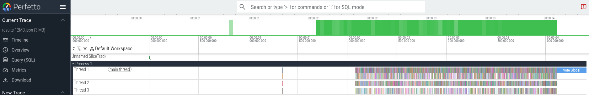

# Constraint model for Leios resource usage

## Scenario

1. The model starts at time $t_0 = 0$.
2. There are a total of $n_\text{cpu}$ CPUs.
3. The first event `RH` occurs after some delay, $\Delta t_\text{RH}$.
4. Then two sequences of events occur in parallel:
	1. `RB` processing:
		1. An event `RB` occurs after some delay, $\Delta t_\text{RB}$.
		2. Each `RB` contains $n_\text{RB}$ transactions that form a directed acyclic graph (DAG) rooted at the previous ledger state of unspent transaction outputs (UTxOs).
		3. The transactions must undergo cryptographic verification, and this can be done in parallel, with CPU delay $c_\text{verify}$.
		4. According to the partial ordering in the DAG, transactions must sequentially undergo ledger application, with CPU delay $c_\text{apply}$ after the cryptographic verification for the transaction is complete.
		5. When all of the DAG has been processed, the `RB` processing is considered to be complete.
	2. `EH` processing:
		1. An event `EH` occurs after some delay, $\Delta t_\text{EH}$.
		2. Each `EH` references $n_\text{EB}$ transactions that form a DAG that extends the DAG of the `RB`.
		3. In parallel each transaction referenced in the `EH`, which we call the `TBi` events, arrives after some delay $\Delta t_{\text{TB},i}$, where $i \in EH$.
		4. After a `TBi` arrives, it can be verified with CPU delay $c_\text{verify}$. All of the `TBi` verifications can be done in parallel.
5. `EB` processing occurs, potentially in parallel, as both `RB` processing and `EH` processing occur.
	1. According to the partial ordering in the DAG, transactions must sequentially undergo ledger application, with CPU delay $c_\text{apply}$ after the cryptographic verification for the transaction is complete. This processing can begin as soon as the "upstream" ledger applications (of the `RB` or `EB`) are complete.
	2. When all of the DAG has been processed, the `EB` processing is considered to be complete.
6. The `VT` event occurs after all of the above is complete, with CPU delay $c_\text{vote}$.
7. The model ends at time $t_1$.

Overall, we have a large DAG of computations where the `RB` event reveals the DAG, but the individual `TBi` events incrementally extend the DAG. The `TBi` events occur in an arbitrary, externally specified sequence after the `EH` event. The $c_\text{verify}$ process can occur completely in parallel after either the `RB` or `TBi` event, but the $c_\text{apply}$ process can only occur after the upstream part of the DAG is applied. All of the time delays and CPU delays are specified externally. We want to schedule the work subject to the $n_\text{CPU}$ constraint in order to minimize $t_1$.

## Mathematical model

This document describes the Constraint Programming (CP) model used to schedule the validation and application of blockchain transactions on a finite number of CPUs.

### Parameters and constants

#### System configuration

- $N_{CPU}$: The number of available CPUs.
- $T_0 = 0$: System start time.

#### Event triggers

- $\Delta t_{RH}$: Delay until Reference Header ($RH$) arrival.
- $\Delta t_{RB}$: Delay from $RH$ until Reference Block ($RB$) arrival.
- $\Delta t_{EH}$: Delay from $RH$ until Endorsement Header ($EH$) arrival.

#### Transaction data

Let $\mathcal{T}$ be the set of all transactions. For each transaction $i \in \mathcal{T}$:

- $Type_i \in \{RB, EH\}$: The source type of the transaction.
- $\Delta t_{TB,i}$: Additional arrival delay for transaction $i$ (only relevant if $Type_i = EH$; for RB, this is effectively 0).
- $D_{V,i}$: CPU time required to verify transaction $i$ ($c_{\text{verify}, i}$).
- $D_{A,i}$: CPU time required to apply transaction $i$ to the ledger ($c_{\text{apply}, i}$).
- $\mathcal{P}_i$: The set of parent transactions (inputs) that $i$ depends on in the DAG.

####  Global tasks

- $D_{Vote}$: CPU time required for the final voting step ($c_{\text{vote}}$).

### Derived parameters

#### Absolute arrival times

The time at which the data for transaction $i$ is physically available to the system, denoted as $Arr_i$:

$$T_{RH} = \Delta t_{RH}$$$$T_{RB} = T_{RH} + \Delta t_{RB}$$$$T_{EH} = T_{RH} + \Delta t_{EH}$$$$Arr_i = \begin{cases} T_{RB} & \text{if } Type_i = RB \\ T_{EH} + \Delta t_{TB,i} & \text{if } Type_i = EH \end{cases}$$

### Decision variables

We define interval variables representing the start ($s$) and end ($e$) times for the tasks associated with each transaction. For each transaction $i \in \mathcal{T}$:

- **Verification task**: $V_i = [s_{V,i}, e_{V,i})$
- **Application task**: $A_i = [s_{A,i}, e_{A,i})$

For the global process:

- **Vote task**: $VT = [s_{VT}, e_{VT})$

### Constraints

#### Interval consistency

Tasks must run for their specified durations.

$$e_{V,i} = s_{V,i} + D_{V,i} \quad \forall i \in \mathcal{T}$$$$e_{A,i} = s_{A,i} + D_{A,i} \quad \forall i \in \mathcal{T}$$$$e_{VT} = s_{VT} + D_{Vote}$$

#### Data availability (verification)

Verification cannot start before the transaction data arrives.

$$s_{V,i} \ge Arr_i \quad \forall i \in \mathcal{T}$$

#### Pipeline dependency (verify ⟶ apply)

A transaction cannot be applied to the ledger until its cryptographic verification is complete.

$$s_{A,i} \ge e_{V,i} \quad \forall i \in \mathcal{T}$$

#### DAG dependency (UTXO logic)

A transaction cannot be applied to the ledger until all its inputs (parents) have been applied.

$$s_{A,i} \ge e_{A,j} \quad \forall i \in \mathcal{T}, \forall j \in \mathcal{P}_i$$

#### Global synchronization (vote)

The final vote can only occur after all transactions have been applied to the ledger.

$$s_{VT} \ge e_{A,i} \quad \forall i \in \mathcal{T}$$

#### Cumulative resource constraint

At any instant in time $t$, the number of active tasks must not exceed the number of CPUs. Let $\mathbb{1}_I(t)$ be an indicator function that is 1 if time $t$ falls within interval $I$, and 0 otherwise.

$$\sum_{i \in \mathcal{T}} \left( \mathbb{1}_{V_i}(t) + \mathbb{1}_{A_i}(t) \right) + \mathbb{1}_{VT}(t) \le N_{CPU} \quad \forall t \ge 0$$

### Objective function

We seek to minimize the final completion time ("makespan") of the entire process, defined as the end time of the voting task.

$$\text{Minimize } \quad e_{VT}$$

### Performance statistics

After the schedule is determined, we compute the following post-hoc statistics to analyze system efficiency.

#### Basic metrics

- **Makespan (**$M$**)**: The final completion time,$M = e_{VT}$.
- **Total Capacity (**$C_{total}$**)**: The total CPU cycles available during the makespan,$C_{total} = M \times N_{CPU}$.
- **Total Work (**$W_{total}$**)**: The sum of all processing durations, $W_{total} = \sum_{i \in \mathcal{T}} (D_{V,i} + D_{A,i}) + D_{Vote}$.
- **CPU Utilization (**$U$**)**: The fraction of total capacity that was actively used, $U = \frac{W_{total}}{C_{total}}$.

#### Idle time

- **Wallclock idle time (**$I_{wall}$**)**: The total duration where _zero_ CPUs were active, $I_{wall} = M - \text{Measure}\left( \bigcup_{I \in \mathcal{I}_{all}} I \right)$, where $\mathcal{I}_{all}$ is the set of all task intervals $\{V_i\} \cup \{A_i\} \cup \{VT\}$.

#### Phase analysis

We define three phases: $\Phi_{Ver} = \{V_i\}_{\forall i}$, $\Phi_{App} = \{A_i\}_{\forall i}$, and $\Phi_{Vote} = \{VT\}$. For each phase $P \in \{\Phi_{Ver}, \Phi_{App}, \Phi_{Vote}\}$:

- **Phase work (**$W_P$**)**:$W_P = \sum_{task \in P} D_{task}$.
- **Phase fraction (**$F_P$**)**:$F_P = \frac{W_P}{W_{total}}$.
- **Phase wallclock Duration (**$L_P$**)**: $L_P = \max_{task \in P}(e_{task}) - \min_{task \in P}(s_{task})$.
- **Average Parallelism (**$\pi_P$**)**: $\pi_P = \frac{W_P}{L_P}$.

## Solution method

This problem is modeled as a **Constraint Programming (CP)** problem and solved using the **Google OR-Tools CP-SAT Solver**. The CP-SAT solver utilizes **Lazy Clause Generation (LCG)**, a hybrid technique that combines the high-level modeling power of Constraint Programming with the efficient search capabilities of Boolean Satisfiability (SAT) solvers. Instead of statically converting the entire problem into boolean clauses, the solver lazily generates clauses during the search process to explain variable domain reductions and conflicts. Key components of the solution method include:

- **Cumulative Constraint Propagators**: The resource limit ($N_{CPU}$) is enforced using specialized propagators such as **Time Tabling** and **Edge Finding**. These algorithms analyze the energy of tasks within a time window to deduce stronger bounds on start times (e.g., proving that a subset of tasks cannot possibly start before a certain time $t$ without violating the resource limit).
- **Conflict-Driven Clause Learning (CDCL)**: When the solver encounters an infeasible state (conflict), it analyzes the implication graph to learn a new "nogood" clause. This clause permanently prunes the search space, preventing the solver from making the same combination of mistakes again.

## Running the constraint solver

The Python program [main.py](./main.py) solves the scheduling constraints for a Leios scenario.

```console
$ python main.py

usage: main.py [-h] [--generate-dummy FILE] [--out-yaml FILE] [--out-trace FILE] [--out-gantt FILE] [--out-csv FILE] [-v]
               [--log-solver] [--gap GAP] [--abs-gap ABS_GAP]
               [input_file]

Blockchain Transaction Scheduler

positional arguments:
  input_file            Input scenario file (JSON/YAML)

options:
  -h, --help            show this help message and exit
  --generate-dummy FILE
                        Generate a dummy input file and exit
  --out-yaml FILE       Path to output YAML results
  --out-trace FILE      Path to output Chrome Trace JSON
  --out-gantt FILE      Path to output Gantt chart PNG
  --out-csv FILE        Path to output CSV results
  -v, --verbose         Print schedule to stdout
  --log-solver          Enable internal solver progress logging
  --gap GAP             Relative gap tolerance (e.g. 0.01 for 1%)
  --abs-gap ABS_GAP     Absolute gap tolerance in microseconds
```

The output YAML file contains the schedule of all operations, and the Chrome Trace JSON formats that for use in the [Perfetto Viewer](https://ui.perfetto.dev). Beware that producing a Gantt chart for a large block takes a long time. The CSV output file can be imported into [Grafana](https://grafana.com/).

Two scenarios are provided, but `python main.py --generate-dummy` will create a small example.

- [scenario-2MB.yaml](./scenario-2MB.yaml): the first 2 MB of transactions from Cardano mainnet starting at Epoch 600.
- [scenario-12MB.yaml](./scenario-12MB.yaml): the first 12 MB of transactions from Cardano mainnet starting at Epoch 600.

The smaller example runs quickly:

```console
$ python main.py --out-yaml results-2MB.yaml --out-trace results-2MB.json scenario-2MB.yaml

Reading scenario from scenario-2MB.yaml...
Solving for 3477 transactions on 4 CPUs...

Final t1 (Makespan): 4368925 µs

========================================
PERFORMANCE STATISTICS
========================================
CPU Utilization:       4.5%
Wallclock Idle:        83.8% (3660619 µs)
----------------------------------------
Phase  | Work %   | Parallelism
----------------------------------------
Ver    | 50.5%    | 0.14
App    | 11.1%    | 0.03
Vote   | 38.5%    | 1.00
========================================

YAML results written to: results-2MB.yaml
Chrome Trace written to: results-2MB.json
```

Use the `--log-solver` flag to monitor the progress for large scenarios. One can interrupt the result with `^C`, which will cause the current best solution to be output. The message `best:4413340 next:[4413326,4413339]` below indicates that the best solution so far is `4413340 µs` and that the optimal solution falls in the interval `[4413326 µs,4413339 µs]`.

```console
$ python main.py --out-yaml results-12MB.yaml --out-trace results-2MB.json scenario-2MB.yaml

Reading scenario from scenario-12MB.yaml...
Solving for 19812 transactions on 4 CPUs...

Starting CP-SAT solver v9.15.6755

. . .

Starting search at 6.41s with 16 workers.
11 full problem subsolvers: [default_lp, fixed, lb_tree_search, max_lp, no_lp, objective_lb_search, probing, pseudo_costs, quick_restart, quick_restart_no_lp, reduced_costs]
5 first solution subsolvers: [fj(2), fs_random, fs_random_no_lp, fs_random_quick_restart_no_lp]
14 interleaved subsolvers: [feasibility_pump, graph_arc_lns, graph_cst_lns, graph_dec_lns, graph_var_lns, lb_relax_lns, ls, ls_lin, rins/rens, rnd_cst_lns, rnd_var_lns, scheduling_intervals_lns, scheduling_precedences_lns, scheduling_time_window_lns]
3 helper subsolvers: [neighborhood_helper, synchronization_agent, update_gap_integral]

#Bound  16.54s best:inf   next:[4413326,7338749] reduced_costs
#1      70.51s best:4413961 next:[4413326,4413960] fs_random_quick_restart_no_lp
#2      91.50s best:4413340 next:[4413326,4413339] no_lp
^C

. . .

Final t1 (Makespan): 4413961 µs

========================================
PERFORMANCE STATISTICS
========================================
CPU Utilization:       18.5%
Wallclock Idle:        58.4% (2578290 µs)
----------------------------------------
Phase  | Work %   | Parallelism
----------------------------------------
Ver    | 74.2%    | 0.89
App    | 16.6%    | 0.20
Vote   | 9.2%     | 1.00
========================================

YAML results written to: results-12MB.yaml
Chrome Trace written to: results-12MB.json
```

Results for the two examples are available at [ipfs://bafybeidmyotni665ze2ii3kez6r7r5afv3xdpuplrsxf4vmijbw4umzfze](https://ipfs.functionally.io/ipfs/bafybeidmyotni665ze2ii3kez6r7r5afv3xdpuplrsxf4vmijbw4umzfze/).


