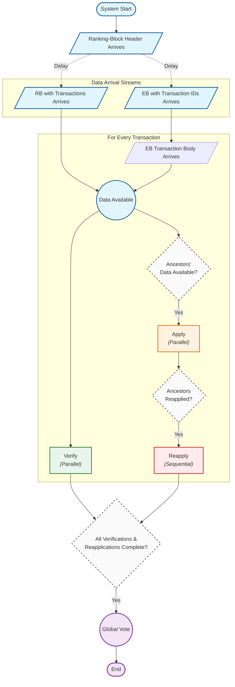

# Constraint model for Leios resource usage

## Scenario

1. The model starts at time $T_0 = 0$.
2. There are a total of $n_\text{CPU}$ CPUs available for processing.
3. The first event `RH` (Ranking-Block Header) occurs after some delay, $\Delta t_\text{RH}$.
4. Two streams of transactions arrive subsequently, forming a directed acyclic graph (DAG) rooted at the previous ledger state (`LG` nodes, which are instantly available):
    1. `RB` (Ranking-Block Body) transactions arrive at $\Delta t_\text{RB}$ as part of the `RB`.
    2. `EB` (Endorser Block) transaction IDs arrive at $\Delta t_\text{EB}$ as part of the `EB`, but the transaction bodies each arrive after an individual delay $\Delta t_{\text{TB},i}$.
5. As transactions arrive, they undergo three distinct processing phases:
    1. **Verification:** A transaction can undergo cryptographic verification (of its transaction hash and the signatures for spending its inputs), with CPU delay $c_{\text{verify}, i}$, as soon as it physically arrives. All verifications can occur in parallel, bounded only by the available CPUs.
    2. **Application:** A transaction can undergo its initial ledger application (just validating the transaction but not actually updating the ledger), with CPU delay $c_{\text{apply}, i}$, as soon as _the transaction itself and all of its upstream ancestors_ have arrived. This phase can occur in parallel with Verification.
    3. **Reapplication:** According to the partial ordering in the DAG, transactions must sequentially undergo final application (just updating the ledger but not re-validating the already-validated transaction), with CPU delay $c_{\text{reapply}, i}$. This can only occur after the transaction's own initial Application is complete, AND the Reapplication of all its upstream parent transactions is complete.
6. The `VT` (Vote) event occurs after all Verification and Reapplication tasks across the entire DAG are complete, requiring CPU delay $c_\text{vote}$. If the node is not a voter, then the voting phase is replaced by a certificate-verification phase.
7. The model ends at time $T_1$.

Overall, we have a large DAG of computations extending a preexisting ledger state. The transaction data incrementally arrives via `RB` and `EB` events at externally specified times. The $c_\text{verify}$ processes can execute completely in parallel upon arrival. The initial $c_\text{apply}$ processes can also execute in parallel with verification, provided all upstream transaction data is available. Finally, the $c_\text{reapply}$ processes strictly enforce the sequential DAG ordering. All time delays and individual CPU processing costs are specified externally. We schedule this work subject to the $n_\text{CPU}$ constraint in order to minimize the final completion time, $t_1$.



## Mathematical model

This document describes the Constraint Programming (CP) model used to schedule the validation and application of blockchain transactions on a finite number of CPUs.

### Parameters & Constants

#### System configuration

- $N_{CPU}$: The number of available CPUs.
- $T_0 = 0$: System start time.

#### Event triggers

- $\Delta t_{RH}$: Delay until Ranking-Block Header ($RH$) arrival.
- $\Delta t_{RB}$: Delay from $RH$ until Ranking-Block Body ($RB$) arrival.
- $\Delta t_{EB}$: Delay from $RH$ until Endorser Block ($EB$) arrival.

#### Transaction data

Let $\mathcal{T}$ be the set of all transactions. For each transaction $i \in \mathcal{T}$:

- $Type_i \in \{LG, RB, EB\}$: The source type of the transaction. $LG$ (Ledger) nodes represent previous state roots and require no processing.
- $\Delta t_{TB,i}$: Additional arrival delay for transaction $i$ (relevant if $Type_i = EB$; 0 otherwise).
- $D_{V,i}$: CPU time required to verify transaction signatures ($c_{\text{verify}, i}$).
- $D_{A,i}$: CPU time required to initially apply transaction $i$ ($c_{\text{apply}, i}$).
- $D_{R,i}$: CPU time required to reapply transaction $i$ ($c_{\text{reapply}, i}$).
- $\mathcal{P}_i$: The set of parent transactions (inputs) that $i$ spends/depends on in the DAG.

#### Global tasks

- $D_{Vote}$: CPU time required for the final voting step ($c_{\text{vote}}$), or certificate verification (depending upon whether the node is a voter or not).

### Derived parameters

#### Absolute arrival times

The time at which the data for transaction $i$ is physically available to the system, denoted as $Arr_i$:

$$T_{RH} = \Delta t_{RH}$$$$T_{RB} = T_{RH} + \Delta t_{RB}$$$$T_{EB} = T_{RH} + \Delta t_{EB}$$$$Arr_i = \begin{cases} 0 & \text{if } Type_i = LG \\ T_{RB} + \Delta t_{TB,i} & \text{if } Type_i = RB \\ T_{EB} + \Delta t_{TB,i} & \text{if } Type_i = EB \end{cases}$$

#### Maximum ancestor arrival time

The initial `Apply` phase can only begin when a transaction and _all_ of its upstream ancestors have been seen by the node. We define $MaxAncArr_i$ recursively:

$$MaxAncArr_i = \max \left( Arr_i, \max_{j \in \mathcal{P}_i} MaxAncArr_j \right)$$

#### Decision variables

We define interval variables representing the start ($s$) and end ($e$) times for the tasks associated with each active transaction (where $Type_i \neq LG$).

For each transaction $i \in \mathcal{T} \setminus \{LG\}$:

- **Verify task**: $V_i = [s_{V,i}, e_{V,i})$
- **Apply task:** $A_i = [s_{A,i}, e_{A,i})$
- **Reapply task**: $R_i = [s_{R,i}, e_{R,i})$

For the global process:

- **Vote task**: $VT = [s_{VT}, e_{VT})$

### Constraints

#### Interval consistency

Tasks must run for their specified durations.

$$e_{V,i} = s_{V,i} + D_{V,i} \quad \forall i$$$$e_{A,i} = s_{A,i} + D_{A,i} \quad \forall i$$$$e_{R,i} = s_{R,i} + D_{R,i} \quad \forall i$$$$e_{VT} = s_{VT} + D_{Vote}$$

#### Data availability (verify & apply)

Verification can begin as soon as the specific transaction is seen.

$$s_{V,i} \ge Arr_i \quad \forall i$$

Application can begin as soon as the transaction _and all its ancestors_ are seen. (Note: $V_i$ and $A_i$ can execute in parallel).

$$s_{A,i} \ge MaxAncArr_i \quad \forall i$$

#### Pipeline dependency (apply ⟶ reapply)

A transaction cannot be reapplied until its initial application is complete.

$$s_{R,i} \ge e_{A,i} \quad \forall i$$

#### DAG dependency (UTxO logic for reapply)

A transaction cannot be reapplied to the ledger until all its active inputs (parents) have been reapplied. (Parents of type $LG$ are already in the ledger state).

$$s_{R,i} \ge e_{R,j} \quad \forall i \in \mathcal{T} \setminus \{LG\}, \forall j \in \mathcal{P}_i \setminus \{LG\}$$

#### Global synchronization (vote)

The final vote can only occur after all transactions have been fully verified and reapplied to the ledger.

$$s_{VT} \ge e_{R,i} \quad \forall i$$$$s_{VT} \ge e_{V,i} \quad \forall i$$

#### Cumulative resource constraint

At any instant in time $t$, the number of active tasks must not exceed the number of CPUs.

Let $\mathbb{1}_I(t)$ be an indicator function that is 1 if time $t$ falls within interval $I$, and 0 otherwise.

$$\sum_{i \in \mathcal{T} \setminus \{LG\}} \left( \mathbb{1}_{V_i}(t) + \mathbb{1}_{A_i}(t) + \mathbb{1}_{R_i}(t) \right) + \mathbb{1}_{VT}(t) \le N_{CPU} \quad \forall t \ge 0$$

### Objective function

We seek to minimize the final completion time ("makespan") of the entire process, defined as the end time of the voting task.

$$\text{Minimize } \quad e_{VT}$$

### Performance statistics

After the schedule is determined, we compute the following post-hoc statistics to analyze system efficiency.

#### Basic metrics

- **Makespan (**$M$**)**: The final completion time: $M = e_{VT}$.
- **Total Capacity (**$C_{total}$**)**: The total CPU cycles available during the makespan:$C_{total} = M \times N_{CPU}$.
- **Total Work (**$W_{total}$**)**: The sum of all processing durations: $W_{total} = \sum_{i} (D_{V,i} + D_{A,i} + D_{R,i}) + D_{Vote}$.
- **CPU Utilization (**$U$**)**: The fraction of total capacity that was actively used.$U = \frac{W_{total}}{C_{total}}$.

#### Idle time

- **Wallclock Idle Time (**$I_{wall}$**)**: The total duration where _zero_ CPUs were active: $I_{wall} = M - \text{Measure}\left( \bigcup_{I \in \mathcal{I}_{all}} I \right)$, where $\mathcal{I}_{all}$ is the set of all task intervals $\{V_i\} \cup \{A_i\} \cup \{R_i\} \cup \{VT\}$.

#### Phase analysis

We define four phases: $\Phi_{Ver} = \{V_i\}$, $\Phi_{App} = \{A_i\}$, $\Phi_{Rea} = \{R_i\}$, and $\Phi_{Vote} = \{VT\}$. For each phase $P$:

- **Phase Work (**$W_P$**)**: $W_P = \sum_{task \in P} D_{task}$
- **Phase Fraction (**$F_P$**)**: $F_P = \frac{W_P}{W_{total}}$
- **Phase Wallclock Duration (**$L_P$**)**: $L_P = \max_{task \in P}(e_{task}) - \min_{task \in P}(s_{task})$
- **Average Parallelism (**$\pi_P$**)**: $\pi_P = \frac{W_P}{L_P}$

### Solution method

This problem is modeled as a **Constraint Programming (CP)** problem and solved using the **Google OR-Tools CP-SAT Solver**. The CP-SAT solver utilizes **Lazy Clause Generation (LCG)**, a hybrid technique that combines the high-level modeling power of Constraint Programming with the efficient search capabilities of Boolean Satisfiability (SAT) solvers. Instead of statically converting the entire problem into boolean clauses, the solver lazily generates clauses during the search process to explain variable domain reductions and conflicts. Key components of the solution method include:

- **Cumulative Constraint Propagators**: The resource limit ($N_{CPU}$) is enforced using specialized propagators such as **Time Tabling** and **Edge Finding**. These algorithms analyze the energy of tasks within a time window to deduce stronger bounds on start times (e.g., proving that a subset of tasks cannot possibly start before a certain time $t$ without violating the resource limit).
- **Conflict-Driven Clause Learning (CDCL)**: When the solver encounters an infeasible state (conflict), it analyzes the implication graph to learn a new "not good" clause. This clause permanently prunes the search space, preventing the solver from making the same combination of mistakes again.
- **Absolute/Relative Gap Tolerance**: The solver allows halting the search early if a solution is found within a defined bounded distance of the theoretical optimal makespan.

## Running the constraint solver

The Python program [main.py](https://www.google.com/search?q=./main.py "null") solves the scheduling constraints for a Leios scenario.

```
$ python main.py

usage: main.py [-h] [--generate-dummy FILE] [--out-yaml FILE] [--out-trace FILE] [--out-gantt FILE] [--out-csv FILE] [-v]
               [--log-solver] [--gap GAP] [--abs-gap ABS_GAP]
               [input_file]

Blockchain Transaction Scheduler

positional arguments:
  input_file            Input scenario file (JSON/YAML)

options:
  -h, --help            show this help message and exit
  --generate-dummy FILE
                        Generate a dummy input file and exit
  --out-yaml FILE       Path to output YAML results
  --out-trace FILE      Path to output Chrome Trace JSON
  --out-gantt FILE      Path to output Gantt chart PNG
  --out-csv FILE        Path to output CSV results
  -v, --verbose         Print schedule to stdout
  --log-solver          Enable internal solver progress logging
  --gap GAP             Relative gap tolerance (e.g. 0.01 for 1%)
  --abs-gap ABS_GAP     Absolute gap tolerance in microseconds
```

The output YAML file contains the schedule of all operations, and the Chrome Trace JSON formats that for use in the [Perfetto Viewer](https://ui.perfetto.dev "null"). Beware that producing a Gantt chart for a large block takes a long time. The CSV output file can be imported into [Grafana](https://grafana.com/ "null").

Two scenarios are provided, but `python main.py --generate-dummy` will create a small example.

- [scenario-2MB.yaml](./scenario-2MB.yaml): the first 2 MB of transactions from Cardano mainnet starting at Epoch 600.
- [scenario-6MB.yaml](./scenario-6MB.yaml): the first 2 MB of transactions from Cardano mainnet starting at Epoch 600.
- [scenario-12MB.yaml](./scenario-12MB.yaml): the first 12 MB of transactions from Cardano mainnet starting at Epoch 600.

The smaller example runs quickly:

```
$ python main.py --out-yaml results-2MB.yaml --out-trace results-2MB.json scenario-2MB.yaml

Reading scenario from scenario-2MB.yaml...
Solving for 3477 transactions on 4 CPUs...

Final t1 (Makespan): 4904844 µs

========================================
PERFORMANCE STATISTICS
========================================
CPU Utilization:       4.0%
Wallclock Idle:        88.6% (4345530 µs)
----------------------------------------
Phase      | Work %   | Parallelism
----------------------------------------
Verify     | 4.2%     | 0.01
Apply      | 46.2%    | 0.12
Reapply    | 11.1%    | 0.03
Vote       | 38.5%    | 1.00
========================================

YAML results written to: results-2MB.yaml
Chrome Trace written to: results-2MB.json
```

Use the `--log-solver` flag to monitor the progress for large scenarios. One can interrupt the result with `^C`, which will cause the current best solution to be output. The message `best:3740829 next:[3740821,3740828]` below indicates that the best solution so far is `3740829 µs` and that the optimal solution falls in the interval `[3740821 µs, 3740828 µs]`. Note that running this scenario requires approximately 90 GB of memory and 4.5 hours on 24 CPUs.

```
$ python main.py --out-yaml results-12MB.yaml --out-trace results-2MB.json scenario-2MB.yaml

Reading scenario from scenario-12MB.yaml...
Solving for 19812 transactions on 4 CPUs...

Starting CP-SAT solver v9.15.6755

. . .

15 full problem subsolvers: [default_lp, fixed, lb_tree_search, max_lp_sym, no_lp, objective_lb_search, objective_shaving_max_lp, objective_shaving_no_lp, probing, probing_max_lp, probing_no_lp, pseudo_costs, quick_restart, quick_restart_no_lp, reduced_costs]
9 first solution subsolvers: [fj(3), fj_lin, fs_random, fs_random_no_lp(2), fs_random_quick_restart, fs_random_quick_restart_no_lp]
16 interleaved subsolvers: [feasibility_pump, graph_arc_lns, graph_cst_lns, graph_dec_lns, graph_var_lns, lb_relax_lns, ls(2), ls_lin, rins/rens, rnd_cst_lns, rnd_var_lns, scheduling_intervals_lns, scheduling_precedences_lns, scheduling_time_window_lns, variables_shaving]
3 helper subsolvers: [neighborhood_helper, synchronization_agent, update_gap_integral]

#Bound  19.67s best:inf   next:[3480871,6416378] objective_shaving_no_lp (vars=31501 csts=77322)
#Bound  21.62s best:inf   next:[3740821,6416378] probing_no_lp (initial_propagation)
#1     1699.51s best:3740829 next:[3740821,3740828] fs_random_no_lp
#2     1699.93s best:3740823 next:[3740821,3740822] no_lp
#3     14011.17s best:3740822 next:[3740821,3740821] scheduling_time_window_lns (d=1.27e-03 s=112470 t=0.10 p=0.00 stall=0 h=base) [hint]
#Model 14082.17s var:31500/31501 constraints:56322/77322
#4     16500.48s best:3740821 next:[]         scheduling_precedences_lns (d=3.16e-04 s=527912 t=0.10 p=0.06 stall=0 h=base) [hint]

. . .

Final t1 (Makespan): 3740821 µs

========================================
PERFORMANCE STATISTICS
========================================
CPU Utilization:       21.9%
Wallclock Idle:        61.2% (2289582 µs)
----------------------------------------
Phase      | Work %   | Parallelism
----------------------------------------
Verify     | 6.4%     | 0.09
Apply      | 67.8%    | 0.98
Reapply    | 16.6%    | 0.24
Vote       | 9.2%     | 1.00
========================================
YAML results written to: results-12MB.yaml
Chrome Trace written to: results-12MB.json
```

Results for the two examples are available at [ipfs://QmYpmGeHvNmWxk3fwbrY8vq9jJSG89DzDGT2fUQ6Nqon4p](https://ipfs.functionally.io/ipfs/QmYpmGeHvNmWxk3fwbrY8vq9jJSG89DzDGT2fUQ6Nqon4p/).

## Experimental results

### CPU: 1 core vs 4 cores

In this experiment, CPU utilization scales less and less than linearly as the EB size increases. Three CPUs are sufficient to handle the workload and most of the time is spent waiting for transaction bodies to arrive.

| EB size | CPUs |    Wallclock | CPU utilization | Verify parallelism | Apply parallelism | Reapply parallelism |
| ------: | ---: | -----------: | --------------: | -----------------: | ----------------: | ------------------: |
|    2 MB |    1 | 4 989 006 µs |           15.6% |               0.01 |              0.12 |                0.03 |
|         |    4 | 4 904 844 µs |            4.0% |               0.01 |              0.12 |                0.03 |
|    6 MB |    1 | 5 924 047 µs |           29.3% |               0.03 |              0.36 |                0.09 |
|         |    4 | 5 483 392 µs |            7.9% |               0.04 |              0.42 |                0.11 |
|   12 MB |    1 | 5 067 936 µs |           64.5% |               0.06 |              0.63 |                0.15 |
|         |    4 | 3 740 821 µs |           21.9% |               0.09 |              0.98 |                0.24 |

### Adversarial delay

In this experiment, the adversary releases all of the EB transaction bodies at the same time, forcing the receiving node to process them starting at the same moment. Four CPUs are sufficient and the computation can be completed within about two seconds of the last transaction body's arrival.

| EB size |  CPUs | Wallclock after last tx arrival | CPU utilization after last tx arrival |
| ------: | ----: | ------------------------------: | ------------------------------------: |
|    2 MB | 4 CPU |                    1 415 249 µs |                                   10% |
|    6 MB | 4 CPU |                    1 654 208 µs |                                   22% |
|   12 MB | 4 CPU |                    2 037 688 µs |                                   42% |
