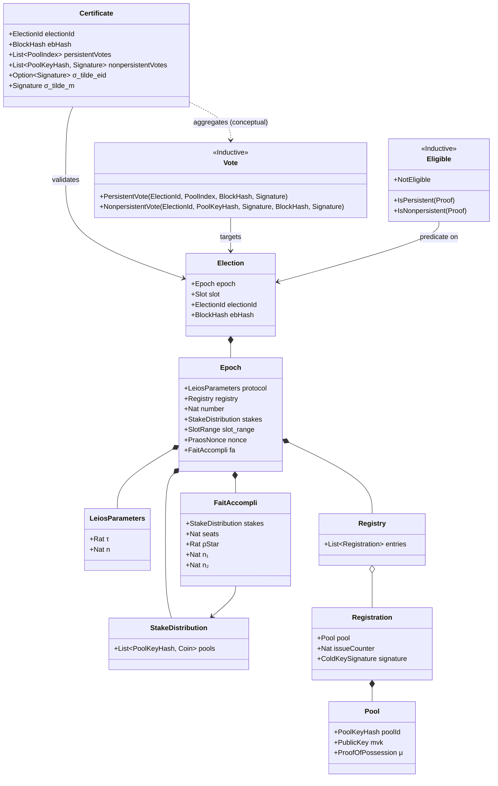

# Non-normative formal specifications for Leios sortition, votes, and certificates in Lean4

See [the read-me in the parent folder](../ReadMe.md) for context and further references.


## Status

This formal specification is a **non-normative** attempt to disambiguate and clarify concepts and relationships in [the original normative specifications](../ReadMe.md).


## Type relationships




## Conventions for constraints

- `WellFormed` constraints ensure that values have basic internal consistency.
- `Valid` constraints ensure that values are consistent with their context.
- `Authentic` constraints ensure that values are cryptographically verified.
- `Checked` constraints simply ensure `WellFormed ∧ Valid ∧ Authentic`.


## Source

- [BLS.lean](./src/Leioscrypto/BLS.lean): primitive BLS types, functions, and axioms.
- [Certificate.lean](./src/Leioscrypto/Certificate.lean): certificates.
- [Contexts.lean](./src/Leioscrypto/Contexts.lean): protocol parameters, epochs, and elections.
- [FaitAccompli.lean](./src/Leioscrypto/FaitAccompli.lean): Fait Accompli sortition.
- [LocalSortition.lean](./src/Leioscrypto/LocalSortition.lean):  local sortition.
- [Registration.lean](./src/Leioscrypto/Registration.lean): key registration.
- [StakeDistribution.lean](./src/Leioscrypto/StakeDistribution.lean): stake distribution.
- [Types.lean](./src/Leioscrypto/Types.lean): basic types.
- [Util.lean](./src/Leioscrypto/Util.lean): miscellaneous functions and theorems.
- [Vote.lean](./src/Leioscrypto/Vote.lean): votes.


## Type-checking and testing the specification

A [Nix shell derivation](./shell.nix) is provided for type-checking the specification and executing its test suite.

```bash
nix-shell
lake build
lake test
```
