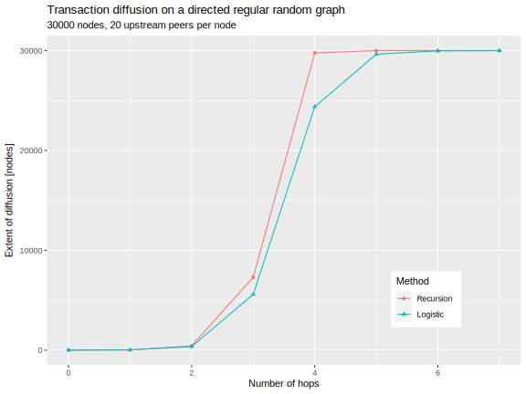
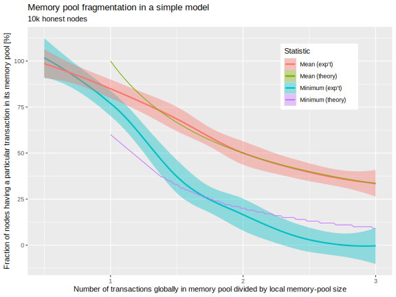
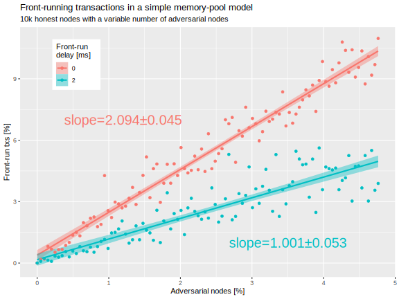

# Mathematical model of the memory pool

This document describes a simple mathematical model of the Ouroboros memory-pool behavior, and suitable for idealized analyses of Praos and Leios. We apply it to the problem of memory-pool poisoning by adversarial nodes that attempt to front-run honest transactions that they receive.

## Variables

| Symbol      | Units     | Description                                     |
| ----------- | --------- | ----------------------------------------------- |
| $`\delta`$  | s/hop     | Per-hop diffusion time                          |
| $`\alpha`$  | block/s   | Active slot coefficient                         |
| $`\sigma`$  | tx/s      | Transaction submission rate                     |
| $`b`$       | kB/tx     | Typical transaction size                        |
| $`B`$       | kB/block  | Block size                                      |
| $`\kappa`$  | kB/s      | Blockchain capacity                             |
| $`\rho`$    | 1         | Relative tx load                                |
| $`\lambda`$ | hop       | Effective number of hops                        |
| $`\tau`$    | s         | Typical diffusion time                          |
| $`N`$       | node      | Number of nodes in network                      |
| $`k`$       | link/node | Typical upstream or downstream degree of a node |

## Basic relationships

- Blockchain capacity: $`\kappa = \alpha \cdot B`$.
- Data rate: $`\sigma \cdot b`$.
- Effective load: $`\rho = \frac{\sigma \cdot b}{\kappa} = \frac{\sigma \cdot b}{\alpha \cdot B}`$.
- Characteristic diffusion time: $`\tau = \lambda \cdot \delta`$.

## Estimating the typical diffusion time

Start with the assumption that the Ouroboros topology approximates a *directed* [regular random graph](https://en.wikipedia.org/wiki/Random_regular_graph) (RRG), which aims to have the optimal information-transmission characteristics of a [Ramanujan graph](https://en.wikipedia.org/wiki/Ramanujan_graph). The Ouroboros network design documents[^1] do not state this explicitly, but it is a consequence of the churning of hot/warm/cold peers and targets and constraints on the number of peers. In particular, that scheme prevents the Ouroboros topology from becoming a [scale-free network](https://en.wikipedia.org/wiki/Scale-free_network): instead, the upstream or downstream degree of a node tends towards a typical value, which we idealize as $`k`$.

Consider the diffusion of a transaction from the node where it is submitted to the rest of the nodes. Let $`h_i`$ be the number of nodes it has reached in the $`i`$th hop and $`H_i = \sum_{j=0}^i h_j = H_{i-1} + h_i`$ be the cumulative number of nodes it has reached by the $`i`$th hop. The transaction starts with $`h_0 = 1`$ and $`H_0 = 1`$. For a directed RRG the expected number of hops will be

$$
\mathbb{E} \left[ h_{i+1} \right] = \left( N - H_i \right) \left( 1 - \left( 1 - \frac{1}{N} \right) ^ {h_i k^\prime} \right)
$$

where the effective degree $`k^\prime = k - \frac{k}{N - k} = k \cdot \frac{N - 2}{N - 1} \approx k`$, for large $N$, accounts for possibility that a downstream peer is also an upstream peer. The first factor represents the number of nodes to which the transaction has not already diffused and the second factor is the probability that at least one of the $`k^\prime`$ neighbors of the $`n_i`$ nodes hasn't received the transactions. If we replace the expectation by $`h_{i+1}`$ itself, then for large $N$ we can approximate the cumulative number of nodes diffused to as

$$
H_i = \frac{N}{1 + \left( \frac{N}{H_0} - 1 \right) k^{-i}} ,
$$

which happens to be a [logistic distribution](https://en.wikipedia.org/wiki/Logistic_distribution) with mean $`\log_k N`$ and scale $`(\ln k)^{-1}`$. Under the RRG assumption we have $`\lambda = \log_k N`$.

For Cardano `mainnet` the recommended active peers[^2] is $`k = 20`$ and there are roughly $`N = 25000`$ nodes participating in the network. The recursion relation yields a mean number of hops of $`3.75 \text{ hops}`$, but the approximate method yields a mean $`\log_k N \approx 3.44 \text{ hops}`$ and standard deviation $`\frac{\pi}{k \cdot \sqrt{3}} \approx 0.61 \text{ hops}`$. The following plot illustrates that the recursion relation yields a more rapid diffusion and saturation. This roughly agrees with the anecdotal diameter of five or six for `mainnet`: the transaction reaches 24% of the network in three hops and 99% of it in four hops. A reasonable value for the typical number of hops for transaction diffusion is $`\lambda = 4 \text{ hops}`$.

## Overlap between memory pools

First consider the situation where each node's memory pool can hold $`m`$ unique transactions of the $`k`$ transactions that are available globally. Under the assumption of uniform at-random diffusion of transactions, the number of transactions $`s`$ shared between any pair of nodes' memory pools conforms to a hypergeometric distribution,

$$
\mathbb{P} (s \text{ transactions in common}) = \frac{{m \choose s} \cdot {k - m \choose m - s}}{k \choose m} .
$$

The mean is $`\mathbb{E}[s]= \frac{m^2}{k}`$ and the standard deviation is $`\sqrt{\mathbb{Var}[s]} = \frac{m \cdot (k - m)}{k \cdot \sqrt{k - 1}} \approx \frac{m \cdot (k - m)}{k^{3/2}}`$, but if we define $`\xi = \frac{k}{m}`$ as the "overburden" of transactions relative to the memory-pool capacity, we have $`\mathbb{E}[s] = \frac{m}{\xi}`$ and  $`\sqrt{\mathbb{Var}[s]} = \frac{\xi - 1}{\xi} \cdot \sqrt{\frac{m}{\xi}}`$. The maximum standard deviation occurs at $`\xi = 3`$ but the maximum standard deviation relative to the mean is unbounded. At $`\xi = 1`$ there is no variance.

### Comparison with simulation experiments

The figure below compares the hypergeometric model to simulation experiments for memory pool fragmentation. As expected, the theory does not fit well when the number of globally available transactions is approximately the same as the number that fit in a memory pool. Once the transactions exceed the capacity by 50% (i.e., $`\xi \geq \frac{3}{2}`$), agreement is good.

### Generalization to near capacity limit

Since transactions do not propagate instantly, some may not be available for inclusion at particular nodes: the previous not only model assumes randomness in arrival but also that any transaction is available for potential inclusion in the memory pool. We can generalize beyond this by letting $`k`$ be the transactions that are available for inclusion in any pair of pools, but $`k_A`$ and $`k_B`$ are additional transactions that are only available for inclusion in pools $`A`$ or $`B`$. This can model situations such as locally private memory pools or draining of the memory pool by short local forks. For $`s`$ transactions in common and $`s_A`$ and $`s_B`$ in $`A`$ or $`B`$ drawn from the shared pool, we have

$$
\mathbb{P}[s] = \sum_{s_A} \sum_{s_B} \underbrace{\mathbb{P}[s | s_A, s_B]}_{\text{Intersection}} \cdot \underbrace{\mathbb{P}[s_A]}_{\text{Node A}} \cdot \underbrace{\mathbb{P}[s_B]}_{\text{Node B}} , 
$$
where $`\mathbb{P}[s_A] = \left. \binom{k}{s_A} \cdot \binom{s_A}{m-s_A} \middle/ \binom{k+k_A}{m} \right.`$, $`\mathbb{P}[s_B] = \left. \binom{k}{s_B} \cdot \binom{k_B}{m-s_B} \middle/ \binom{k+k_B}{m} \right.`$, and $`\mathbb{P}[s | s_A, s_B] = \left. \binom{s_A}{s} \cdot \binom{k-s_A}{s_B-x} \middle/ \binom{k}{s_B} \right.`$. These are all hypergeometric distributions. For the mean we have $`\mathbb{E}[s] = \frac{m^2 k}{(k + k_A)(k + k_B)}`$, which reduces to the previous result when $`k_A = k_B = 0`$. Thus the expected number of common transactions among the $`A`$ and $`B`$ memory pools is proportional to the dilutions $`\frac{k}{k+k_A}`$ and $`\frac{k}{k+k_B}`$.

In the simulation example of the previous section we see that at $`\xi = 1`$, the expected commonality is reduced from 100% to approximately 81%. This implies that $`k_A = k_B = \frac{k}{9}`$, or that approximately 10% of the transactions are in some sense "private" to a node. This is roughly consistent with a typical diffusion time of $`\tau \approx 2 \text{ s}`$, given the active slot coefficient of $`\alpha = \frac{1 \text{ block}}{20 \text{ s}}`$: namely, we would expect about 10% of the transactions to be "captured" by a nearby block and not propagate globally among all memory pools. Presumably we can interpret this as $`k_A = k_B = \frac{m}{9}`$ because the transactions that do not propagate far because of block production are relative to the size $`m`$ of the memory pool, not relative to the global transactions $`k`$. Therefore for much larger $`k`$, the private transactions become less important in the factor $`\frac{k}{k + \frac{m}{9}}`$ and predictions approach the original case of uniformly at-random diffusion.

## Poisoned memory pools

Now consider the scenario where there is a fraction of the nodes, $`p_\text{adv}`$, are adversarial in that when an adversarial node receives a transaction, it _does not announce it to its upstream peers_: instead, it creates a new, conflicting transaction and announces that instead. This scenario aims to mimic front-running or MEV (miner extractable value): the adversarial node replaces each transaction with one to its own advantage. _In real life, of course, only a fraction of transactions (arbitrage opportunities, entries in order books, etc.) might be susceptible to such front running._

The front-run transactions compete with the original honest ones to diffuse faster to the block-producing node. Because the honest and front-run version of the transaction conflict with one another (i.e., consume at least one common input), only one of them can be accepted into a node's memory pool. Honest nodes accept transactions on a first-come first-serve basis, but will not accept a transaction that conflicts with its memory pool. We consider a memory pool to be "poisoned" if it contains the dishonest replacement of the transaction. Under the RRG assumption, the probability of an honest memory pool having been poisoned is the sum up to the graph's diameter of the fraction of nodes a given number of hops away times the probability of any intermediate node having been poisoned:

$$
p_\text{poison} \approx \sum_{i=1}^\lambda \frac{h_i}{N - 1} \left( 1 - \left( 1 - p_\text{adv} \right) ^ {i - 1}) \right) \approx 1 - \left( 1 - p_\text{adv} \right)^{\lambda-1} .
$$

For a small fraction of adversaries, this reduces to $`p_\text{adv} \cdot (\lambda - 1)`$.

### Comparison with simulation experiments

We can compare the previous result to [simulation experiments](../mempool-sim-web/experiment). Consider varying the fraction of adversarial nodes in two experiments:

1. **No delay:** The adversarial node forwards their front-run transaction without any delay. *This conforms the the mathematical model above and creates unbiased competition between honest and front-run transactions.* We should expect a fraction $`p_\text{adv} \cdot (\lambda - 1)`$ of the memory pool to become poisoned.
2. **Substantial delay:** The adversarial node waits two milliseconds before forwarding their front-run transaction. *This permits honest nodes to diffuse the honest transaction before receiving the front-run one.* We should expect a fraction $`p_\text{adv}`$ of the memory pool to become poisoned because only the honesty of the final node matters.

Set $`N=10\,000`$ and $`k = 20`$, which implies $`\lambda \doteq 3.074`$. Thus, when plotting the fraction of memory pools poisoned as a function of the fraction of adversaries, we expect a slope of $`2.074`$ in the no-delay case and a slope of $`1`$ in the substantial-delay case. These slopes agree with the experimental results illustrated below.

[^1]: See [Introduction to the design of the Data Diffusion and Networking for Cardano Shelley](https://ouroboros-network.cardano.intersectmbo.org/pdfs/network-design/network-design.pdf) and [Ouroboros Network Specification](https://ouroboros-network.cardano.intersectmbo.org/pdfs/network-spec/network-spec.pdf.).
[^2]: See [the default mainnet configuration file for cardano-node](https://github.com/IntersectMBO/cardano-node/blob/9cf1e651e9fc3726a5fa9771b0d3479e5b909c6b/configuration/cardano/mainnet-config.yaml#L49).
