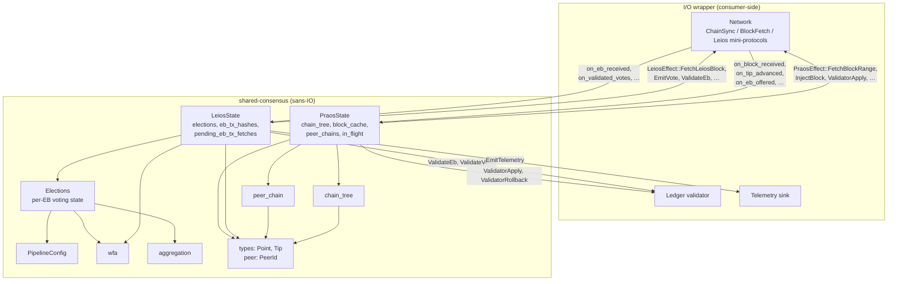
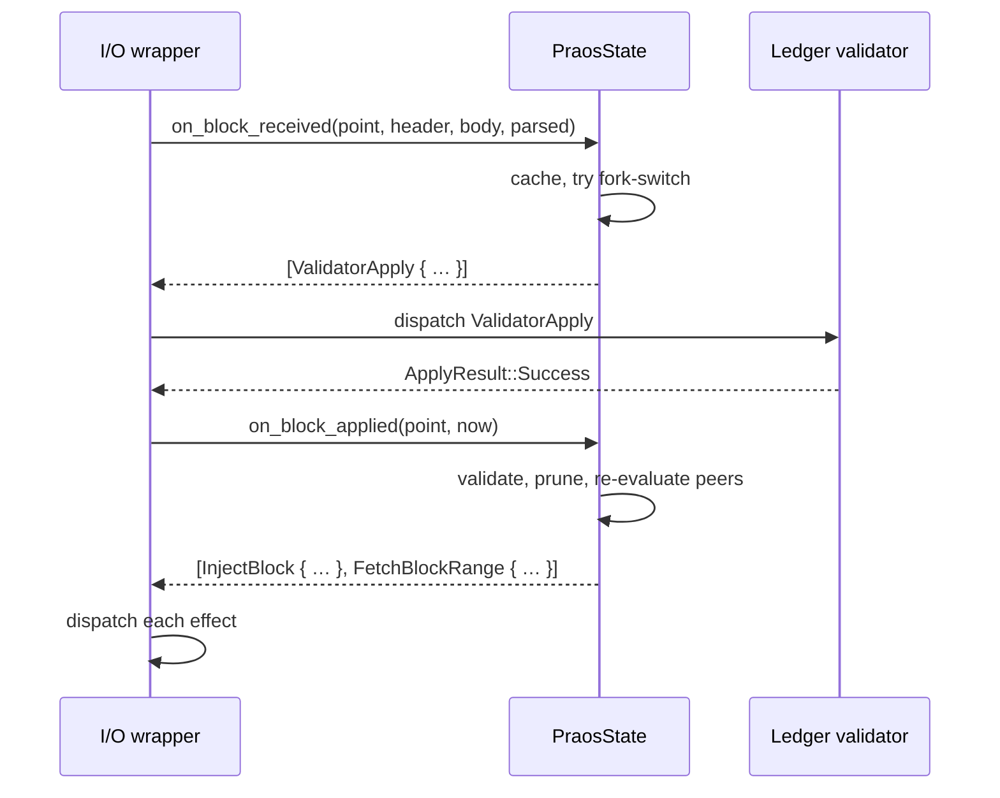
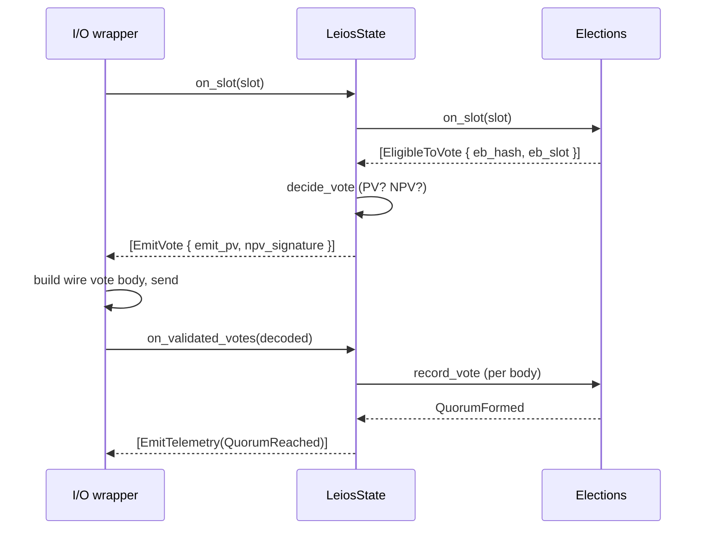
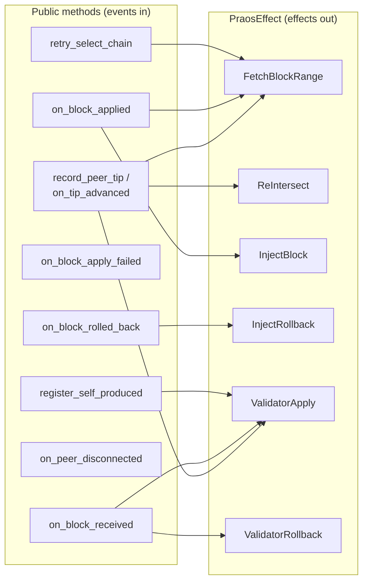
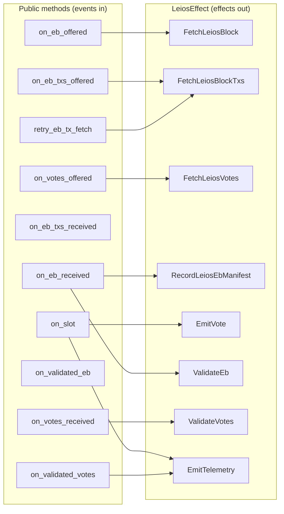
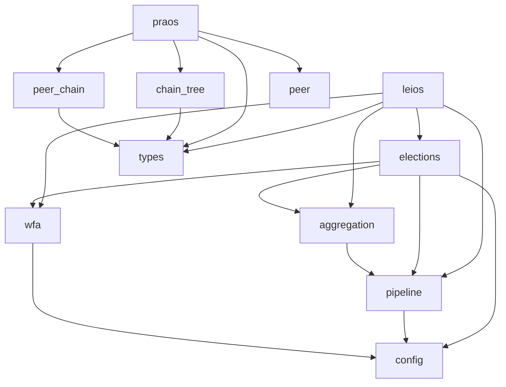

# shared-consensus

Sans-IO Cardano consensus core. The protocol pieces every
Cardano-Leios implementation must agree on, packaged as a single crate
with no networking, clock, or async runtime — so multiple consumers
(production node, deterministic simulator, fuzzers) can share one
implementation.

## What's in here

| Module          | Responsibility                                                  |
|-----------------|------------------------------------------------------------------|
| `types`         | `Point`, `Tip` with minicbor codec                               |
| `peer`          | `PeerId(u64)` newtype                                            |
| `config`        | `CommitteeSelection` enum (WfaLs / EveryoneVotes / StakeCentile) |
| `pipeline`      | EB lifecycle phases (Voting → CertEligible → expiry)             |
| `wfa`           | Weighted Fait Accompli + Local Sortition committee selection     |
| `aggregation`   | Per-EB vote tally, quorum detection                              |
| `chain_tree`    | In-memory chain DAG, best-tip selection, prune-below-k           |
| `peer_chain`    | Per-peer announced fragment (cap-bounded VecDeque)               |
| `elections`     | Per-EB election state machine; slot ticks → `SlotEffect`         |
| `praos`         | Praos longest-chain state + selection → `PraosEffect`            |
| `leios`         | Linear Leios voting + EB-tx fetch state → `LeiosEffect`          |

The two big state machines are `PraosState` and `LeiosState`. Each
owns its own state, accepts injected `Instant` for time-sensitive
methods, and returns a `Vec<Effect>` describing actions for the caller
to dispatch.

## Architecture



## Effect-driven flow

Both state machines are pure functions of their state plus the input
event. They never call out — the caller drains effects after each
method:



The same pattern drives Leios voting:



## Praos state machine — events and effects



## Leios state machine — events and effects



## Determinism

`sim-rs` replays whole runs from a seed; shared-consensus must not
introduce non-determinism. The constraints:

- All iteration is over `BTreeMap` / `BTreeSet`. No `HashMap` iteration
  in hot paths.
- Effect ordering is part of the contract: e.g., `Elections::on_slot`
  emits all `EligibleToVote` (sorted by `eb_hash`) before any
  `Expired`.
- Time enters as `Instant` parameters, never `Instant::now()`.
- Randomness flows through `wfa.rs` helpers seeded by stable bytes
  (EB hash, voter id) — there is no `thread_rng` or `from_entropy`
  call anywhere in the crate.

## Module dependencies



Nothing in shared-consensus depends on `tokio`, `hyper`, or any
networking crate.

## Building and testing

```sh
cargo build
cargo test
cargo clippy --all-targets -- -D warnings
```

Test layout: every module has its own `#[cfg(test)] mod tests` block.
There are no integration tests — the effect-emission API makes every
scenario directly mockable from a unit test (construct state, drive
events, assert on returned `Vec<Effect>`).

## Consumer integration

A consumer wraps each state machine with an async I/O layer that:

1. Receives wire-format messages from the network and translates them
   into logical args (parsed header info, decoded vote bodies).
2. Calls the appropriate `on_*` method on `PraosState` / `LeiosState`.
3. Drains the returned `Vec<Effect>` and dispatches each variant to
   the right channel — block fetch coordinator, ledger validator,
   telemetry sink, etc.
4. Owns the `Instant` clock; passes `Instant::now()` into methods
   that need it.

See the consumer crates for example wrappers.
