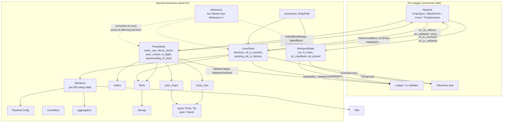
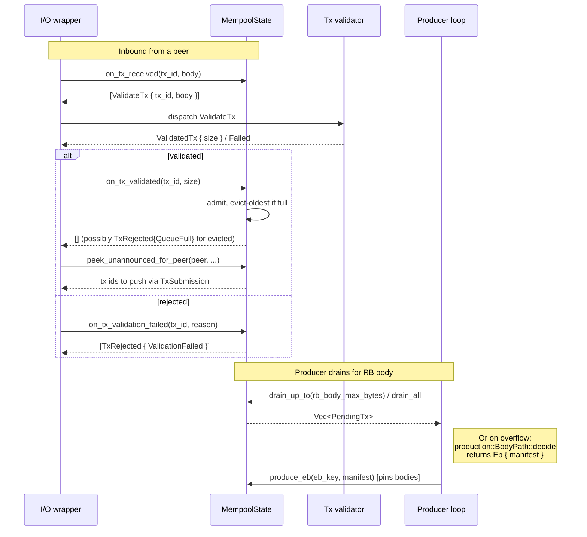
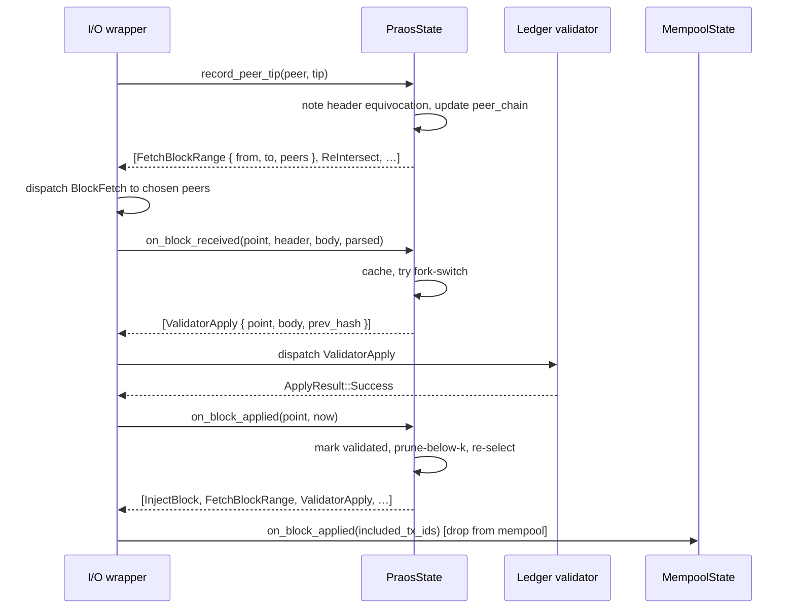
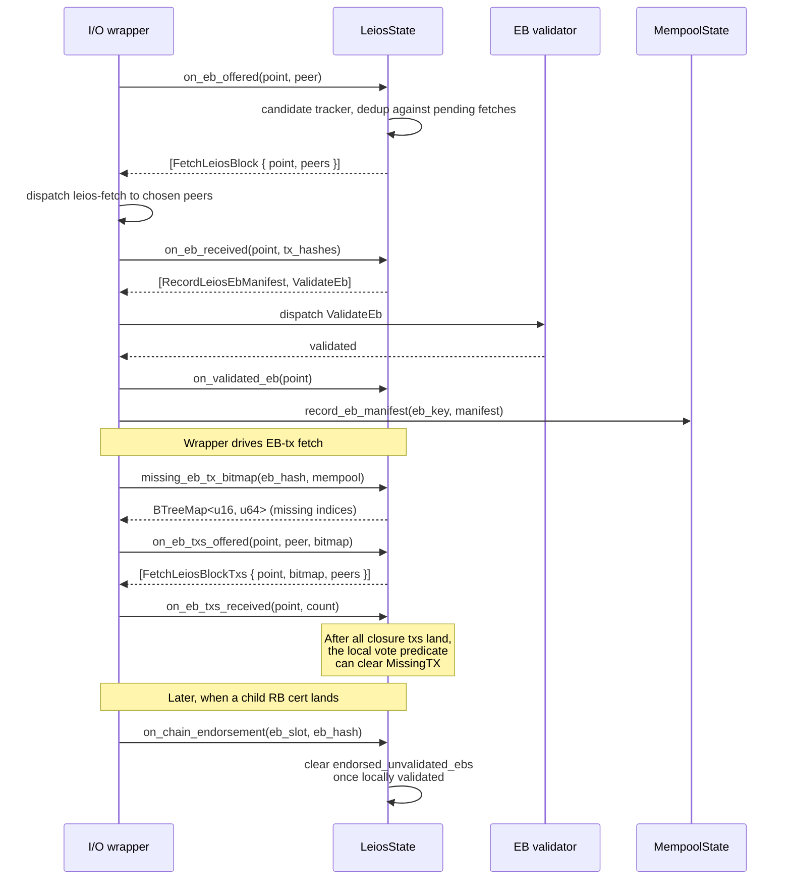
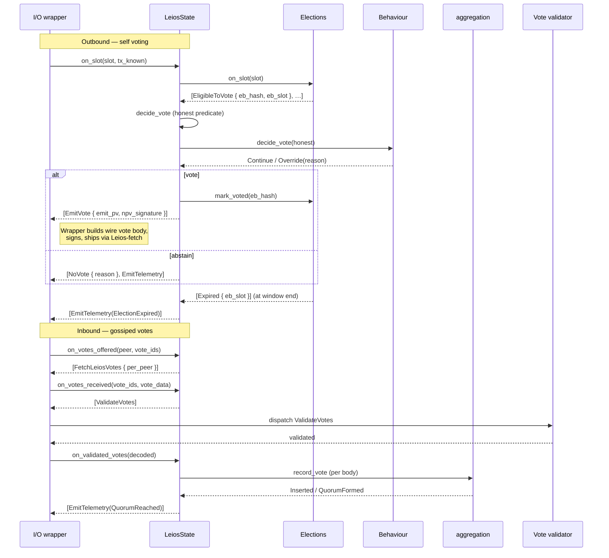
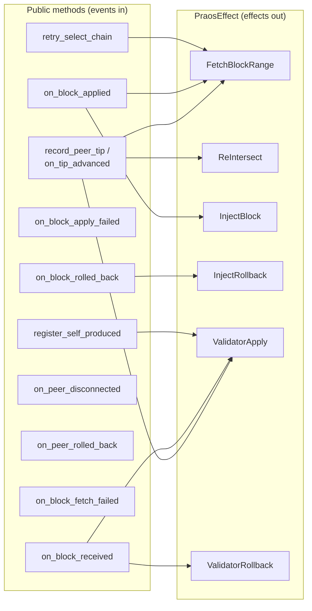
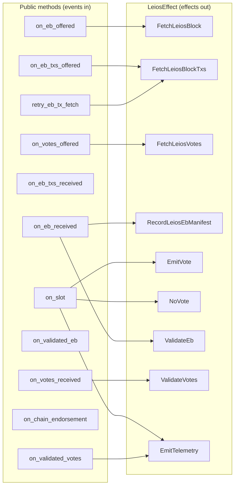
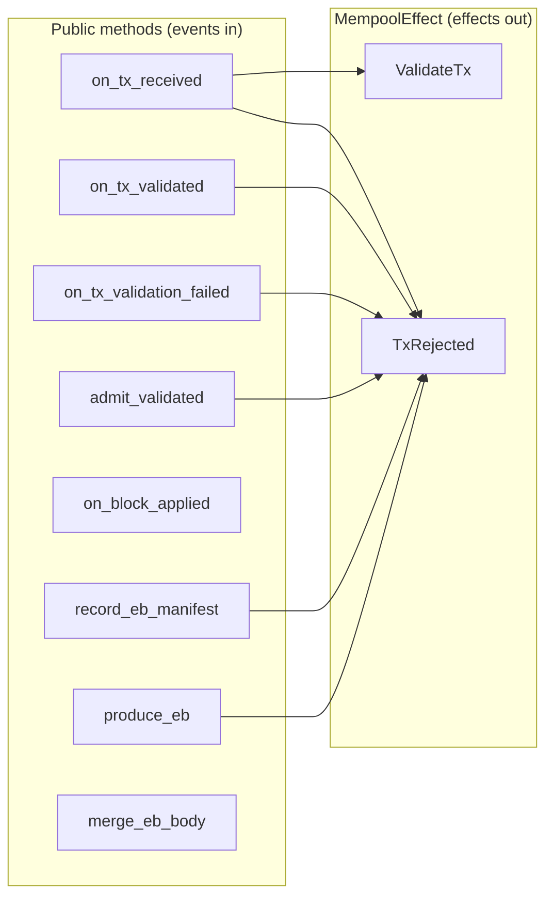
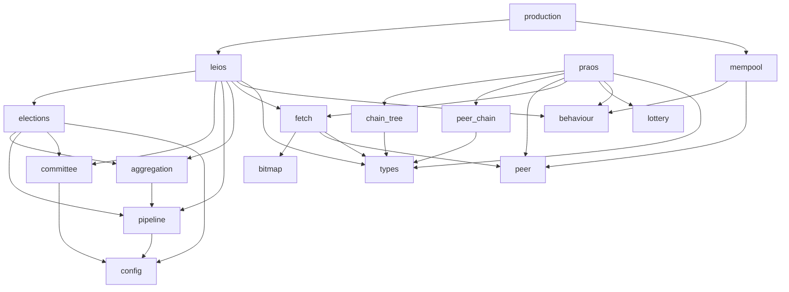

# shared-consensus

Sans-IO Cardano consensus core. The protocol pieces every
Cardano-Leios implementation must agree on, packaged as a single crate
with no networking, clock, or async runtime — so multiple consumers
(production node, deterministic simulator, fuzzers) can share one
implementation.

## What's in here

| Module          | Responsibility                                                  |
|-----------------|------------------------------------------------------------------|
| `types`         | `Point`, `Tip` with minicbor codec                               |
| `peer`          | `PeerId(u64)` newtype                                            |
| `config`        | `CommitteeSelection` enum (WfaLs / EveryoneVotes / StakeCentile) |
| `pipeline`      | EB lifecycle phases (Voting → CertEligible → expiry)             |
| `committee`     | Committee selection (WfaLs, EveryoneVotes, StakeCentile), NPV lottery |
| `lottery`       | Praos f_block stake-weighted threshold formula                   |
| `aggregation`   | Per-EB vote tally, quorum detection                              |
| `bitmap`        | Sparse `BTreeMap<u16, u64>` for `MsgLeiosBlockTxsRequest`        |
| `chain_tree`    | In-memory chain DAG, best-tip selection, prune-below-k           |
| `peer_chain`    | Per-peer announced fragment (cap-bounded VecDeque)               |
| `fetch`         | Pluggable per-channel fetch policies + candidate tracker         |
| `elections`     | Per-EB election state machine; slot ticks → `SlotEffect`         |
| `praos`         | Praos longest-chain state + selection → `PraosEffect`            |
| `leios`         | Linear Leios voting + EB-tx fetch state → `LeiosEffect`          |
| `mempool`       | Bounded tx pool + EB-pinned bodies → `MempoolEffect`             |
| `production`    | Producer-side body-path picker (inline / EB / empty-for-safety)  |
| `behaviour`     | Pluggable per-node hooks for adversarial / experimental variants |

The three big state machines are `PraosState`, `LeiosState` and
`MempoolState`. Each owns its own state, accepts injected `Instant` for
time-sensitive methods, and returns a `Vec<Effect>` describing actions
for the caller to dispatch. See [`src/behaviour/README.md`](src/behaviour/README.md)
for the per-node hook system that lets consumers slot adversarial
variants into any of the three without forking the honest control flow.

## Architecture



## Effect-driven flow

Each state machine is a pure function of its state plus the input
event. They never call out — the caller drains effects after each
method, dispatches them, and feeds outcomes back in. The four major
event flows below cover transactions, RBs, EBs, and votes.

### Transactions — admit, advertise, drain

The mempool moves a tx through validate → admit → advertise on the
inbound side, then drains it into an RB body (or an EB manifest) on
the producer side.



### Ranking Blocks — header → fetch → validate → adopt



Producer side: when this node wins the slot lottery
(see `lottery::rb_win_threshold`), the wrapper consults
`Behaviour::rb_production_strategy`, decides the body path via
`production::BodyPath::decide`, and calls
`Praos::register_self_produced` — which routes through the same
validation pipeline so self-produced blocks land in the chain on the
same on_block_applied path.

### Endorser Blocks — offer → fetch → validate → endorse

EB diffusion is two-stage: the wrapper fetches the EB **body** (the
ordered tx-hash manifest), then fans out per-tx fetches for the
bodies it doesn't already hold.



### Votes — election → emit → diffuse → quorum



## Praos state machine — events and effects



## Leios state machine — events and effects



## Mempool state machine — events and effects



## Behaviour hooks

`PraosState`, `LeiosState`, and `MempoolState` each own a
`BehaviourHandle = Arc<Mutex<Box<dyn Behaviour>>>`. Every
protocol-affecting decision consults the behaviour first: reactive
hooks (`on_*`) can `Continue`, `Replace`, or `Append` effects; decision
hooks (`decide_vote`, `decide_body_path`) can override the honest
choice; strategy hooks (`rb_production_strategy`) tell the wrapper to
suppress or equivocate. A separate per-peer outbound transform path
([`Behaviour::transform_outbound`]) lets a behaviour drop or rewrite an
artefact differently for each peer it goes out to — the basis for
peer-split equivocation and eclipse simulations.

Behaviours are deserialised from config via the
`BehaviourSpec` enum (`kind = "honest"`, `"lazy-voter"`,
`"rb-header-equivocator"`, `"composite"`), seeded from the per-node id,
and composable. The honest default is a no-op; concrete behaviours
override only what they need.

See [`src/behaviour/README.md`](src/behaviour/README.md) for the full
trait surface, dispatch rules, registry, and the recipe for shipping a
new behaviour.

## Fetch policies

Each fetch channel (Praos block fetch, Leios EB fetch, Leios EB-tx
fetch, Leios vote fetch) has its own policy trait in
[`fetch`](src/fetch.rs). Stock implementations:

- `LowestRttFirst` — pick the single peer with the lowest measured RTT.
- `BroadcastN` — fan a fetch out to the N best peers.

RTT lookup is a borrowed `PeerRtt` handle passed at call time; the
shared `PeerRttCache` carries live measurements between the wrapper's
KeepAlive handler and the state machines. Candidate-peer sets and
in-flight dedup live in `CandidateTracker`, fed by the wrapper's
`note_*_offered` calls when it observes an offer on the wire.

## Determinism

`sim-rs` replays whole runs from a seed; shared-consensus must not
introduce non-determinism. The constraints:

- All iteration is over `BTreeMap` / `BTreeSet`. No `HashMap` iteration
  in hot paths.
- Effect ordering is part of the contract: e.g., `Elections::on_slot`
  emits all `EligibleToVote` (sorted by `eb_hash`) before any
  `Expired`.
- Time enters as `Instant` parameters, never `Instant::now()`.
- Randomness flows through `committee.rs` and `lottery.rs` helpers seeded by
  stable bytes (EB hash, voter id, stake) — there is no `thread_rng`
  or `from_entropy` call anywhere in the crate.
- Behaviours follow the same rules: they take a seed at construction
  and hash it with the per-decision key (peer id, slot, …).

## Module dependencies



Nothing in shared-consensus depends on `tokio`, `hyper`, or any
networking crate.

## Building and testing

```sh
cargo build
cargo test
cargo clippy --all-targets -- -D warnings
```

Test layout: every module has its own `#[cfg(test)] mod tests` block.
There are no integration tests — the effect-emission API makes every
scenario directly mockable from a unit test (construct state, drive
events, assert on returned `Vec<Effect>`).

## Consumer integration

A consumer wraps each state machine with an async I/O layer that:

1. Receives wire-format messages from the network and translates them
   into logical args (parsed header info, decoded vote bodies).
2. Calls the appropriate `on_*` method on `PraosState` / `LeiosState`
   / `MempoolState`.
3. Drains the returned `Vec<Effect>` and dispatches each variant to
   the right channel — block fetch coordinator, ledger validator,
   tx validator, telemetry sink, etc.
4. Owns the `Instant` clock; passes `Instant::now()` into methods
   that need it.
5. (Optional) Hands a `BehaviourHandle` to the state machines at
   construction or via `set_behaviour` / `swap_handle`, and calls
   `transform_outbound` on every peer-targeted send so adversarial
   per-peer rewrites stay invisible to the honest dispatch path.

See the consumer crates for example wrappers.

[`Behaviour::transform_outbound`]: src/behaviour/README.md#outbound-transform--per-peer-rewriting
