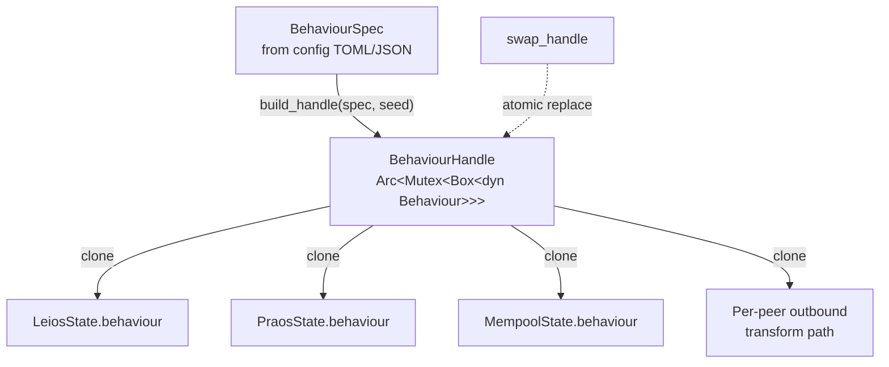
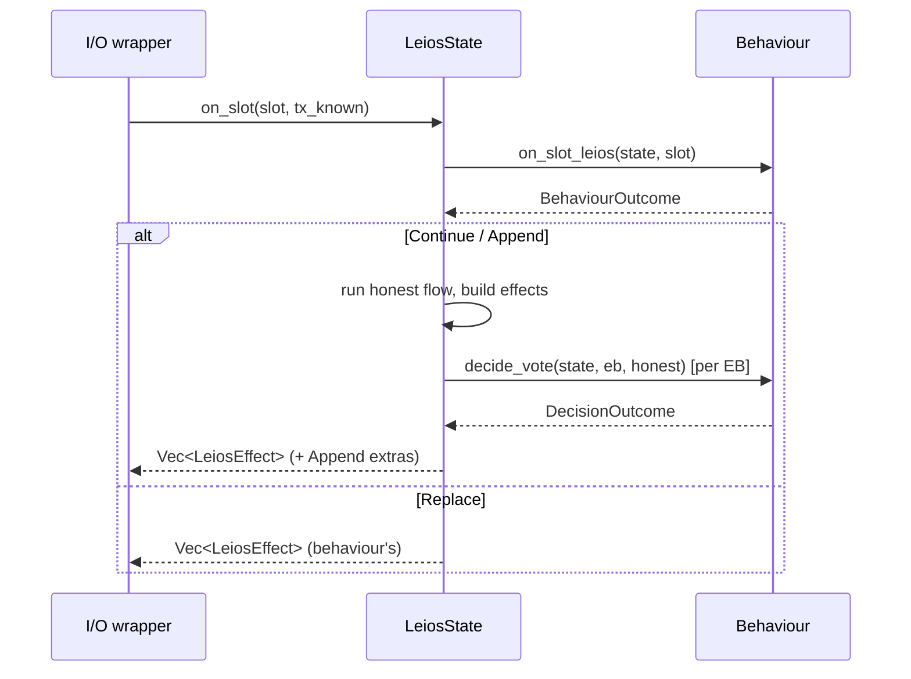

# `behaviour` — pluggable adversarial and experimental hooks

A `Behaviour` is a per-node trait object that the three host state
machines (`LeiosState`, `PraosState`, `MempoolState`) consult at every
protocol-affecting decision point. Behaviours let consumers ship
adversarial variants, lazy committee members, peer-split equivocators
or experimental policies without forking the honest control flow.

The honest default ([`HonestBehaviour`]) is a no-op; concrete behaviours
override only the hooks they care about. All hooks are deterministic —
sim-rs replays runs from a seed, so a behaviour that needs randomness
takes a `u64` at construction and seeds its own RNG, never reading the
clock or the OS entropy pool.

## Hook taxonomy

There are four kinds of hook on the [`Behaviour`] trait. Adding a new
adversary usually means overriding one or two of them.

| Kind | Examples | Return | When fired |
|------|----------|--------|------------|
| **Reactive** (`on_*`) | `on_slot_leios`, `on_eb_offered`, `on_block_received`, `on_tx_received` | `BehaviourOutcome<E>` | At the top of every public `on_xxx` event handler on the host state |
| **Decision** (`decide_*`) | `decide_vote`, `decide_body_path` | `DecisionOutcome<T>` | Inline at a branch point; the honest result is passed in so the behaviour can inspect it |
| **Strategy** (`rb_production_strategy`) | RB-production fork | A small enum | At producer-side decision time, before the wrapper builds the artefact |
| **Notification** (`record_rb_variants`, `find_variant_body`) | Stash + serve adversarial artefacts | `()` / `Option<_>` | The I/O wrapper hands the behaviour just-produced state, or asks for one back |

### Reactive outcomes

[`BehaviourOutcome<E>`] decides what happens to the honest effect list:

```rust
pub enum BehaviourOutcome<E> {
    Continue,            // run honest flow unchanged
    Replace(Vec<E>),     // discard honest fx, use these
    Append(Vec<E>),      // run honest fx AND append these
}
```

The host state combines the outcome with the honest closure via
[`apply_reactive`]. `Continue` and `Append` evaluate the honest flow;
`Replace` short-circuits it.

### Decision outcomes

[`DecisionOutcome<T>`] is the inline-branch counterpart:

```rust
pub enum DecisionOutcome<T> {
    Continue,         // use the honest decision
    Override(T),      // substitute
}
```

`DecisionOutcome::resolve(honest)` collapses the choice to a single `T`.

### Strategy returns

Strategy hooks return a small enum that the wrapper interprets directly:

```rust
pub enum RbProductionStrategy {
    Normal,                       // produce one honest RB
    Suppress,                     // produce no RB (selective withholding)
    Equivocate { ways: u8 },      // produce `ways` distinct RB variants
}
```

`Normal` is the default; a behaviour overrides only when it wants the
wrapper to do something else.

## Ownership and the `BehaviourHandle`

```rust
pub type BehaviourHandle = Arc<Mutex<Box<dyn Behaviour>>>;
```

Each host state stores one `BehaviourHandle`. The wrapper clones the
Arc to give out-of-band callers — a per-peer outbound transformer, a
production loop deciding how many RBs to sign this slot — access to the
same trait object the host state dispatches against. The Mutex
serialises those calls against the host state's own dispatch; hook
bodies are synchronous and must not await while the guard is held.

The inner `Box` is the swap point: [`swap_handle`] replaces it under
the lock so every Arc-holder observes the new behaviour atomically.
Tests that step a node from honest to adversarial mid-run use this.



## Dispatch flow

For a reactive hook like `LeiosState::on_slot`:



The same shape applies on the Praos and Mempool sides: every public
`on_xxx` enters the behaviour first, then either takes over (`Replace`),
appends to the honest result (`Append`), or steps aside (`Continue`).

## Composition

[`CompositeBehaviour`] holds a `Vec<Box<dyn Behaviour>>` and dispatches
each hook through its children in declaration order. For
`BehaviourOutcome` and `DecisionOutcome` hooks, the **first
non-`Continue` result wins** and subsequent children don't run.
Notification hooks (`record_rb_variants`) fan out to every child — a
logger composed with an equivocator should see every variant. Lookups
(`find_variant_body`) return the first non-`None` result.

Composition lets contributors layer (e.g.) "delay-and-equivocate"
without touching either constituent.

## Registry

[`BehaviourSpec`] is the serde-tagged enum that consumers deserialise
from config:

```rust
pub enum BehaviourSpec {
    Honest,
    Composite { children: Vec<BehaviourSpec> },
    RbHeaderEquivocator { ways: u8 },
    LazyVoter { reason: NoVoteReason },
}
```

The wire form is kebab-case-tagged JSON / TOML:

```toml
behaviour = { kind = "composite", children = [
    { kind = "lazy-voter" },
    { kind = "rb-header-equivocator", ways = 3 },
] }
```

[`build(spec, seed)`] materialises the trait object;
[`build_handle(spec, seed)`] wraps it in the `Arc<Mutex<_>>`.
[`swap_handle(handle, spec, seed)`] re-builds in place. Composite
children are seeded via `child_seed(seed, idx)` so siblings get distinct
deterministic streams without correlated lotteries.

[`seed_from_node_id(node_id)`] derives a stable per-node `u64` seed
when the config doesn't supply one explicitly.

## Outbound transform — per-peer rewriting

Reactive hooks fire inside the consensus state's dispatch — they see
effects before the wrapper sends them, but they can't yet split a single
effect into "this version for peer A, that version for peer B." That
split happens in [`Behaviour::transform_outbound`], called by the I/O
wrapper once per peer-targeted send:

```rust
pub enum OutboundDecision {
    Send,                          // unchanged (default)
    Drop,                          // suppress delivery
    Replace(OwnedOutbound),        // peer-split / eclipse
    Augment(Vec<OwnedOutbound>),   // original + extras
}
```

`Outbound<'_>` carries the artefact kind plus the minimum logical
metadata a behaviour needs to recognise it (e.g. RB header slot). Wire
bytes stay opaque — CBOR decoding lives in the wrapper.

The variant set is intentionally narrow; extend it as new adversaries
need new wire artefacts.

## Slot-granular delay — `DelayQueue<E>`

Behaviours that hold effects for N slots before releasing them own a
[`DelayQueue<E>`]:

```rust
let queued = self.queue.drain_up_to(slot);   // fire all due
self.queue.push(slot + 2, effects);          // schedule for later
```

One-slot granularity (~1 s). Sub-slot delay would need its own queue
keyed on `Instant` — out of scope for this crate's discrete-event model.

## Shipped behaviours

| Spec variant | Module | What it does |
|--------------|--------|--------------|
| `Honest` | [`HonestBehaviour`] in `mod.rs` | No-op default; every hook `Continue` / `Normal` |
| `LazyVoter` | [`behaviours::lazy_voter`] | Overrides `decide_vote` to always abstain with `reason` (default `Declined`); measures committee resilience to silent stakeholders |
| `RbHeaderEquivocator` | [`behaviours::rb_equivocator`] | Returns `Equivocate { ways }` from `rb_production_strategy`; stashes variants via `record_rb_variants`; per-peer `transform_outbound` routes each peer bucket a different variant. Trips CIP-0164's RB-header equivocation detection on honest peers |

## Adding a new behaviour

1. **Create the module.** New file under `src/behaviour/behaviours/`
   (e.g. `eclipse_attacker.rs`). One struct, one `impl Behaviour`,
   override only the hooks you need.
2. **Determinism.** If the behaviour makes random choices, take a
   `u64` seed at construction and feed it into a deterministic hash
   (Blake2b is the crate convention) along with the per-decision key
   (peer id, slot, …). Don't call `Instant::now()` or `thread_rng()`.
3. **Register the variant.** Add it to `behaviours::mod.rs` (`pub mod
   ...; pub use ...::*`), a `BehaviourSpec` variant in `registry.rs`,
   and a match arm in [`build`].
4. **Tests.** Cover the override behaviour directly in
   `#[cfg(test)] mod tests`. The honest paths (`HonestBehaviour::on_*`)
   are no-ops, so a one-method override is cheap to assert against.
5. **Document the wire form.** Mention the `kind = "..."` value and
   any parameters in the variant doc-comment; that doc surfaces as the
   wrapper's config schema.

## Determinism — non-negotiable

The crate's whole point is that sim-rs replays runs byte-identically
from a seed. A non-deterministic behaviour breaks the replay contract
and silently corrupts every regression-comparison plot downstream.

- No clock reads inside hook logic. Drive activation off the `slot`
  argument that every reactive hook receives (or `state.elections.cap`
  if you need a tip).
- No `HashMap` / `HashSet` iteration. Use `BTreeMap` / `BTreeSet`
  if your behaviour carries internal state.
- Per-peer decisions go through the seeded hash, not the order peers
  happened to connect in.

If you need a property tests aren't catching, add one — the shipped
behaviours all include a "same seed → same outputs" round-trip test
that's worth copying.

[`apply_reactive`]: super::apply_reactive
[`build`]: super::registry::build
[`build_handle`]: super::registry::build_handle
[`swap_handle`]: super::registry::swap_handle
[`seed_from_node_id`]: super::registry::seed_from_node_id
[`BehaviourSpec`]: super::registry::BehaviourSpec
[`BehaviourHandle`]: super::BehaviourHandle
[`Behaviour`]: super::Behaviour
[`HonestBehaviour`]: super::HonestBehaviour
[`CompositeBehaviour`]: super::CompositeBehaviour
[`BehaviourOutcome<E>`]: super::BehaviourOutcome
[`DecisionOutcome<T>`]: super::DecisionOutcome
[`DelayQueue<E>`]: super::delay::DelayQueue
[`behaviours::lazy_voter`]: super::behaviours::lazy_voter
[`behaviours::rb_equivocator`]: super::behaviours::rb_equivocator
[`Behaviour::transform_outbound`]: super::Behaviour::transform_outbound
