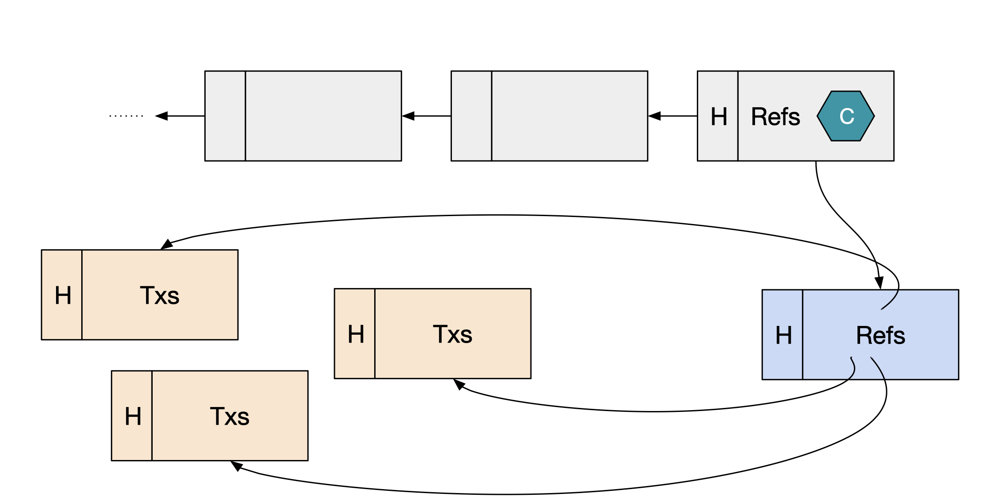

# What is Leios?

:::warning

This web site and the Leios R&D project are in their very early stage. More
details will be added in the forthcoming weeks and months.

:::

_Ouroboros Leios_ is a novel protocol extending
[Ouroboros Praos](https://docs.cardano.org/about-cardano/learn/ouroboros-overview/)
that aims at dramatically increase the _throughput_ of Cardano network. The core
protocol and its theoretical properties are defined in
[this research paper](https://iohk.io/en/research/library/papers/high-throughput-blockchain-consensus-under-realistic-network-assumptions/).

## In a nutshell

_Leios_ is based on the key idea of _input endorsers_. Whereas in a classical
blockchain, the blocks' body directly contains transactions, in Leios the
blocks' body can also contain references to _Endorser blocks_ which themselves
contain references to so-called _Input blocks_ containing the actual
transactions. Those references are _certified_ through a voting mechanism that
guarantees a majority of validators agree on the content of _Endorser blocks_.

By decoupling the logic of validating blocks' payload and extending the
blockchain, and limiting the work needed to verify the chain, much higher
throughput can be achieved and new use cases can be unlocked.

## Tell me more

More documentation about Leios can be found in the following sources:

- The [Leios CIP](https://github.com/cardano-foundation/CIPs/pull/379) by Duncan
  Coutts, providing rationale and a high-level design of the protocol
- The original
  [Research paper](https://iohk.io/en/research/library/papers/high-throughput-blockchain-consensus-under-realistic-network-assumptions/)
  is of course the main reference _north star_
- [This video](https://www.youtube.com/watch?v=Czmg9WmSCcI) from Pr. Aggelos
  Kiayias, IOG's Chief Scientist, explains Leios in the context of _Scaling
  Cardano_
- One of the paper's co-author, Giorgos Panagiotakos, has shot a
  [video](https://www.youtube.com/watch?v=YEcYVygdhzU) explaining Leios
- [These slides](https://docs.google.com/presentation/d/1W_KHdvdLNDEStE99D7Af2SRiTqZNnVLQiEPqRHJySqI/edit?usp=sharing)
  from Sandro Coretti-Drayton, another researcher that worked on Leios might
  also help getting a good intuition about Leios
