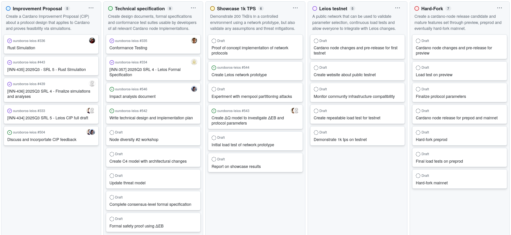

# Roadmap

Leios is about maturing a consensus protocol design from a research paper
through multiple [software readiness
levels](https://committees.docs.intersectmbo.org/intersect-technical-steering-committee/technical-roadmap/project-cards-explained/software-readiness-level)
and ultimately deploy it as a consensus upgrade onto the Cardano network.

## Objectives

Following our [strategy](./strategy.md), we identified several key objectives
along the way which are roughly in order, but not strictly sequential. Instead,
each will give rise to a list of _marketable features_, which we going to
identify, progress and deliver throughout the whole lifecycle of this project.
These objectives and features make up the actual product roadmap, which we are
going to update and report on every month via [this github
project](https://github.com/orgs/input-output-hk/projects/167).

<!-- TODO: go into more detail on why each objective is important and also what's in scope -->

### Improvement Proposal (CIP)

> As the Cardano community, we want to learn as early as possible about what is proposed to change, so that it can be discussed across various groups and committees, and referenced in later on-chain governance.

Create a Cardano Improvement Proposal (CIP) that addresses the [Cardano Problem Statement (CPS) about Greater Transaction Throughput (CPS-18)](https://github.com/cardano-scaling/CIPs/blob/master/CPS-0018/README.md). The proposed protocol design shall be applicable to Cardano and feasibility is proven by relevant analysis and simulations.

Creating a CIP is standard procedure to disseminate and discuss protocol changes on Cardano. It will clearly motivate, specify and provide rationale of a concrete change to the Cardano consensus. The discussion will uncover potential blind spots and allow a broad audience to raise their concerns or signal agreement with the changes. The provided evidence in the form of simulation results and cost analysis will build early confidence about the feasibility of the proposed change and pave the way for required governance decisions to rollout the protocol update in a [hard-fork](#hard-fork).

#### Scope

- Refine the protocol design from what was [published by research](https://eprint.iacr.org/2025/1115.pdf) into possible variants
- Create simulators to empirically explore protocol variants and trade-offs
- Cost analysis and threat modeling
- Propose a CIP to solve CPS-18 on [cardano-foundatios/CIPs](https://github.com/cardano-foundation/CIPs)
- Discuss and incorporate feedback into the CIP

This is a joint effort between innovation and engineering teams from Input Output Research (IOR) and Input Output Engineering (IOE) respectively.

### Technical specification

> As a node developer, I want to understand in detail how the Leios protocol works and whether my node implementation is correct.

Create design documents, formal specifications and conformance test suites usable by developers of all relevant Cardano node implementations.

Leios is a novel consensus protocol and therefore requires a detailed technical specification to ensure that it is implemented correctly by all relevant Cardano node implementations. This includes the `cardano-node` Haskell implementation, but also other emerging consensus nodes like `amaru`. Node diversity is crucial for the security and resilience of Cardano, and therefore it is important that all implementations can be verified against an understandable and precise specification using conformance test suites.

#### Scope

- Node-level design, architecture and impact analysis documents
- Threat modeling and security analysis
- Formal specifications using Agda or similar
- Conformance test suites that can be used by node developers to verify their implementations
- Participate in node diversity workshops and contribute to the `cardano-blueprint`

### Showcase 1k TPS

> As a potential builder, I want to experience the capability of the proposed consensus upgrade and be convinced that it is as secure as claimed.

Demonstrate 200 TkB/s in a controlled environment using a network prototype, but also validate any assumptions and threat mitigations.

A key milestone in the development of Leios is to demonstrate that it can achieve the order of magnitude higher throughput (200 TxkB/s) using real network of nodes albeit in a controlled environment. This will build confidence in the protocol design and its implementation, as well as provide a tangible demonstration of the capacity increase to the broader Cardano community. It also provides an opportunity to validate any assumptions made in the design process. In particular, having an early prototype that exercises the network layer will allow further studies of adversarial scenarios and their mitigations. It will also allow us to identify any potential blind spots or weaknesses in the protocol that need to be addressed before it can be deployed on a more public network.

### Scope

- Network prototype that can be deployed in a controlled environment
- Visually demonstrate throughput increase over Praos
- Early load testing and performance measurements
- Early transaction validation benchmarks and optimizations
- Test adversarial scenarios of stake-based and network-based attacks
- ΔQ modeling and validating protocol parameter selection
- Develop / integrate cryptographic primitives and prepare for audit
- Validate understanding of required changes in key components

### Leios testnet

> As an SPO and Cardano developer, we want a dedicated network for testing and measuring the perfomance of Leios, so that we can update relevant infrastructure and ensure it can handle increased throughput reliably without compromising security.

A larger scale public network that can be used to validate parameter selection, continuous load tests and allow everyone to integrate with Leios changes.

Although we believe that Leios is quite limited in structural changes, it is a consensus change nontheless and will benefit from having a dedicated testnet available as early as possible. A public network specifically for Leios will provide a realistic environment to validate the protocol under more realistic conditions and at a larger scale. It will allow SPOs, developers and other stakeholders to integrate with the changes introduced by Leios and ensure that their infrastructure can handle the increased throughput reliably. The testnet will also provide an opportunity to conduct large-scale experiments, repeated load tests and gather data on the performance of the protocol in a more realistic setting.

### Scope

- Bootstrap and advertise a public testnet dedicated to Leios
- Provide one or more node implementations that work on the testnet
- Create tools and documentation to help SPOs and developers integrate with Leios changes
- Continuous load testing and performance measurements
- Monitor community infrastructure compatibility
- Run large-scale experiments with varying load and parameter settings

### Hard fork

> As an SPO and dRep, we want to have a mature Cardano node implementation that enables Leios and have it made available to all users of Cardano.

Create a `cardano-node` release candidate and mature the feature set through `preview`, `preprod` and eventually enable it with a hard-fork on `mainnet`.
