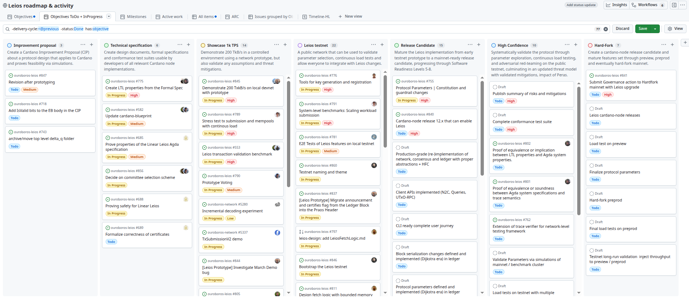

---                                                                                                  
toc_max_heading_level: 4                                                                             
---
# Roadmap

Leios focuses on maturing a consensus protocol design from a research paper through multiple [software readiness
levels](https://committees.docs.intersectmbo.org/intersect-technical-steering-committee/technical-roadmap/project-cards-explained/software-readiness-level), and ultimately deploying it as a consensus upgrade on the Cardano network.

## Objectives

Following our [strategy](#strategy), we identified several key **objectives**. While these objectives are broadly ordered and not strictly sequential, each gives rise to a set of **marketable features** that will be defined, developed, and delivered throughout the project lifecycle.

Together, these objectives and features form the product roadmap, which will be updated and [reported on monthly](./monthly-reviews.md) via this [GitHub project](https://github.com/orgs/input-output-hk/projects/167).

## 2025/2026 
### Improvement proposal 

> As the Cardano community, we want to understand as early as possible what changes are being proposed, so that we can discuss them across relevant groups and committees and reference them in subsequent on-chain governance decisions.

To address the [Cardano Problem Statement (CPS-18)](https://github.com/cardano-scaling/CIPs/blob/master/CPS-0018/README.md) on greater transaction throughput, a Cardano Improvement Proposal (CIP) should define a protocol design applicable to Cardano, with feasibility demonstrated through analysis and simulation.

Publishing a CIP is the standard mechanism for proposing and reviewing protocol changes. It sets out the motivation, specification, and rationale for modifications to the Cardano consensus protocol. Open discussion helps identify blind spots, surface risks, and gather community feedback or support. Supporting evidence, including simulation results and cost analysis, builds confidence in the feasibility and informs governance decisions required to implement the upgrade through a hard fork.

**Scope**

- Refine the protocol design [published by research](https://eprint.iacr.org/2025/1115.pdf) into concrete, implementable variants
- Develop simulators to empirically evaluate protocol variants and explore trade-offs
- Conduct cost analysis and threat modeling
- Propose a CIP to address CPS-18 in the [Cardano Foundation CIP repository](https://github.com/cardano-foundation/CIPs)
- Discuss feedback publicly and incorporate revisions into the CIP.

This work is a joint effort between the innovation and engineering teams at Input Output. 

### Technical specification

> As a node developer, I want to understand in detail how the Leios protocol works and verify that my node implementation is correct.

Produce comprehensive design documents, formal specifications, and conformance test suites for developers of all relevant Cardano node implementations.

Leios introduces a new consensus protocol and therefore requires a precise technical specification to ensure correct and consistent implementation. This applies to the Cardano node Haskell implementation as well as emerging consensus clients such as `amaru`.

Node diversity strengthens Cardano’s security and resilience. Clear specifications, combined with executable conformance test suites, enable independent teams to validate correctness against a common standard and reduce the risk of consensus divergence.

**Scope**

- Produce node-level design, architecture, and impact analysis documents
- Conduct threat modeling and security analysis
- Develop formal specifications in Agda or a comparable formal methods framework
- Deliver conformance test suites that enable node developers to verify correctness
- Participate in node diversity workshops and contribute to the `cardano-blueprint` project.

### Showcase 1k TPS

> As a potential builder, I want to experience the capability of the proposed consensus upgrade and assess whether it meets its security claims.

Demonstrate 200 TkB/s in a controlled network prototype, while validating underlying assumptions and threat mitigations.

A key milestone for Leios is to demonstrate an order-of-magnitude increase in throughput, targeting 200 TkB/s, in a real network of nodes operating in a controlled environment. This provides measurable evidence of capacity gains and strengthens confidence in both the protocol design and its implementation.

An early prototype that exercises the full network layer also enables validation of design assumptions under realistic conditions. It supports structured adversarial testing, assessment of mitigation strategies, and identification of weaknesses that must be resolved before deployment on a public network.

**Scope**

- Develop a network prototype deployable in a controlled environment
- Demonstrate throughput improvements over Praos using clear visual comparisons
- Conduct early load testing and performance measurements
- Benchmark and optimize transaction validation
- Evaluate adversarial scenarios, including stake-based and network-based attacks
- Perform ΔQ modeling and validate protocol parameter selection
- Develop or integrate required cryptographic primitives and prepare them for audit
- Confirm and document required changes across key system components.

### Leios testnet

> As an SPO and Cardano developer, we want a dedicated network to test and measure Leios' performance, so we can update infrastructure and confirm it handles increased throughput without compromising security.

Establish a larger-scale public test network to validate parameter selection, conduct continuous load testing, and support ecosystem integration with Leios.

Although Leios introduces limited structural changes, it modifies consensus and therefore warrants early deployment on a dedicated testnet. A public Leios network would provide a realistic environment to validate protocol behavior at scale and under sustained load.

It would enable SPOs, developers, and infrastructure providers to integrate Leios-related changes, assess operational impact, and verify that systems remain reliable under higher throughput. The network would also support large-scale experiments, repeated load tests, and systematic data collection to inform parameter tuning and readiness for mainnet deployment.

**Scope**

- Bootstrap and promote a public testnet dedicated to Leios
- Provide one or more compatible node implementations for the testnet
- Deliver tools and documentation to support SPO and developer integration
- Conduct continuous load testing and performance measurement
- Monitor infrastructure compatibility across the community
- Run large-scale experiments under varying load conditions and parameter configurations.

---
## 2026 Proposal

### High Confidence

> As a Cardano community member, I want assurance that the Leios protocol is secure and performs as expected under realistic and adversarial conditions, so that I can trust it with real value on mainnet.

Systematically validate the protocol through parameter exploration, continuous load testing, and adversarial red-teaming on the public testnet, culminating in an updated threat model with validated mitigations.

Once the Leios testnet is operational, it provides a larger-scale environment to study protocol behavior under realistic conditions. This objective runs in parallel with the Release Candidate work and is essential for building confidence among developers and the community alike. A threat model was created in the first budget cycle; this objective revisits it systematically and validates that all identified risks have effective mitigations.

#### _Technical feasibility confirmed_

**Scope**

- Systematic study of timing parameters (L_hdr, L_vote, L_diff) and size limits (S_EB, S_EB-tx), including evidence that Praos is unaffected by Leios load
- Continuous load testing under various load profiles
- Synthetic load generation; potential use of condensed mainnet replay
- Identify breaking points and operational margins
- Develop parameter graduation plan: testnet → mainnet → gradual mainnet scale-up
- Publish benchmark report covering every stage of the Leios transaction pipeline on reference cluster hardware

#### _Risks & mitigations validated_

**Scope**

- Stake-based attack testing and quantitative analysis: equivocation, vote splitting, certification threshold manipulation
- Network-based attack testing: delayed propagation, eclipse attacks, partition scenarios
- Red-teaming exercises (extension point for external team involvement)
- Systematic revisit and update of threat model
- Document validated risks and mitigations with community-facing publication
- Specification of the voting scheme and certificate soundness evidence

### Release Candidate

> As a node operator, I want a production-quality node implementation that has been thoroughly tested and reviewed, so that I can confidently prepare for the Leios hard fork.

Mature the Leios implementation from early testnet prototype to a mainnet-ready release candidate, progressing through [Software Readiness Levels](https://committees.docs.intersectmbo.org/intersect-technical-steering-committee/technical-roadmap/project-cards-explained/software-readiness-level) 5–8.

This is the critical path for the entire proposal. The implementation must be substantially rewritten and refined, conformance tested against formal specifications, and integrated into the primary node used by most stake pools before it can be deployed to `preview` and `preprod` testnets and considered in the hard-fork schedule. Feature completeness is defined by CIP-164.

#### _Dijkstra era definition includes Leios_

**Scope**

- Implement Leios block structure and encoding for the Dijkstra ledger era
- Define and implement Leios protocol parameters in the ledger
- Produce a `cardano-node` release (11.x or later) that understands Leios-era blocks
- Coordinate with the Hard Fork Working Group (HFWG) to confirm Leios is included in the Dijkstra era scoping decision

#### _Leios-enabled cardano-node_

**Scope**

- Production-grade implementation of CIP-164 in cardano-node that can be configured through protocol parameters and allows enabling of Leios at a hard-fork boundary
- Progress through SRL 5 (Initial Implementation) → SRL 6 (Main Implementation) → SRL 7 (Integration) → SRL 8 (Mainnet-ready)
- Feature completeness per CIP-164 specification
- Complete conformance test suite against Agda formal specification
- Published performance benchmark report: throughput and latency under sustained Leios load on reference cluster hardware
- CLI support for the complete Leios user journey (key registration, parameter queries, EB inspection)

### Hardfork

> As an ecosystem developer, SPO, or dRep, I want stable interfaces, clear documentation, and all technical and governance prerequisites for the Leios hard fork to be complete, so that I can confidently update our tools, ensure the constitutional requirements are met, and make an informed decision on enabling Leios on mainnet.

Do everything within our control to make the Leios hard fork possible: prepare the broader ecosystem and all technical and governance stakeholders for Leios mainnet activation through stable client interfaces, comprehensive integration documentation, SPO outreach, and community workshops. See through testnet hard-forks, finalize the mainnet parameter graduation plan, coordinate with relevant bodies, and document contingency procedures.

#### _Constitutional updates / governance prepared_

**Scope**

- Prepare updated guardrails script incorporating Leios protocol parameters, ready for submission as part of a Constitution update proposal
- Draft rationale document for the Constitution update explaining why the new parameters and guardrail changes are needed
- Protocol parameter rationale document with recommended initial values and supporting evidence from the risks & mitigations validated milestone
- Consistency check confirming no discrepancies between the ratified CIP-164, the Agda formal specification, and the `cardano-node` implementation
- Coordinate timing and scoping with relevant governance bodies and advocate for Leios inclusion in the hard-fork schedule

#### _Hard-fork enabling Leios_

**Scope**

- Node-to-Client (N2C) mini-protocol and utxo-rpc API updates and stabilization, iterating based on integrator feedback
- Complete implementation-independent technical documentation for Leios (`cardano-blueprint`)
- Tactical support for close-by projects (DbSync, Mithril, Blockfrost, Ogmios)
- SPO and developer workshops, and community coordination on ecosystem readiness
- Integration guide for community developers updating wallets, tools, and SDKs
- Finalize mainnet parameter graduation plan (preview → preprod → mainnet, with gradual mainnet scale-up)
- Document contingency procedures for disabling Leios during an incident
- Hard-fork activation on the preview testnet, with operational report covering EB certification rate, chain quality metrics, and SPO resource utilization

## Strategy

This document outlines the vision, mission, and strategy guiding the development of Ouroboros Leios – the consensus upgrade that will deliver world-class scalability to Cardano. While this document explains _why_ we are building Leios and _how_ we intend to succeed, the separate [roadmap](./roadmap.md) details _what_ we will deliver and _when_.

### Vision and mission 

Leios supports Cardano’s **vision** to be recognised as the best-in-class blockchain – renowned for performance, reliability, security, and true decentralization.

The **mission** is to drive widespread adoption of the Cardano network by delivering a blockchain that is:

-   **Scalable and reliable**, enabling innovation and sustainable growth for developers, businesses, and communities worldwide.
-   **Economically sustainable**, ensuring long-term viability so that stake pool operators (SPOs) remain profitable and the network continues to attract high-quality projects and enterprise solutions.
    
Leios, together with Peras, is the engine that will power Cardano’s global impact.

### Strategy pillars

To achieve Leios’ mission, the strategy builds on three interconnected pillars:

**1. Technical leadership**

Cardano’s core protocol and supporting infrastructure will continue to advance to deliver industry-leading performance. This includes delivering Ouroboros Linear Leios for massive throughput gains and pairing it with Peras for fast finality, while maintaining Ouroboros’ proven security guarantees. By combining rigorous research, formal methods, and continuous simulation-driven validation, Leios is positioned to set the technical benchmark for scalable, decentralized blockchains.

**2. Market repositioning**

Cardano is targeted to become the blockchain that can handle real-world scale without compromise for developers, businesses, and institutions. Through transparent benchmarks, compelling visualizations, clear progress updates, and real-world performance data, perceptions will shift from ‘academic and slow’ to ‘fast, secure, and ready for mass adoption.’

**3. Sustainable decentralization**

Scaling must never come at the expense of decentralization. Leios is designed to increase throughput significantly while keeping hardware and operational requirements for SPOs modest and sustainable. By keeping node costs aligned with growing on-chain revenue, Cardano protects its greatest strength: its unmatched, permissionless, and geographically diverse SPO ecosystem.

### Principles

These principles guide every decision in the development of Leios:

-   **Early validation**: testing ideas and designs as early as possible through simulations, prototypes, and formal verification. This reduces risk and allows the community to provide meaningful feedback before significant resources are committed.
-   **Continuous delivery**: delivering visible value frequently – whether through incremental protocol improvements, new tools, documentation, or educational content – to build trust, maintain momentum, and keep the community engaged.
- **Transparency to ensure acceptance**: operating openly by sharing decisions, data, rationale, and results. This empowers the Cardano community to participate meaningfully in governance and builds broad acceptance for Leios as the foundation of Cardano’s future.

### Key performance indicators (KPIs)

The following metrics are tracked to measure success and maintain transparency:

#### Throughput and performance

-   **Transaction data throughput (TxB/s)**: target 140–300+ TxB/s (30–65× current Praos levels)
-   **Peak TPS**: up to 1,500+ transactions per second under realistic conditions
-   **Inclusion latency**: average time from mempool to ledger inclusion
-   **Finalization time**: ~2 minutes for high-confidence settlement (with Peras)

#### Network efficiency

-   **Resource utilization**: modest increase in CPU/bandwidth per transaction
 -   **Block propagation time**: target less than 5 seconds for global diffusion
-   **Spatial and temporal efficiency**: high ratio of useful transactions to total block data

#### Security and decentralization

-   **Network participation**: a high number of active nodes in block production and endorsement
-   **Consensus integrity**: full preservation of Ouroboros Praos/Genesis security guarantees
-   **SPO hardware requirements**: 6+ cores, 100 Mbps+ bandwidth, SSD storage (modest upgrade)

#### User and developer adoption

-   **Wallet and decentralized applications (DApp) integration**: a number of major wallets and applications supporting Leios
-   **User experience**: significant reduction in congestion-related complaints
-   **SPO adoption rate**: percentage of stake actively running Leios nodes
    
#### Economic and cost efficiency

-   **Transaction fee stability**: predictable and competitive fees even under high load
-   **Node operating costs**: sustainable relative to on-chain revenue growth

#### Scalability and future-proofing

-   **Capacity for future growth**: ability to handle increasing demand with minimal latency impact
-   **Protocol upgrade success**: seamless integration with existing Cardano infrastructure and tooling
