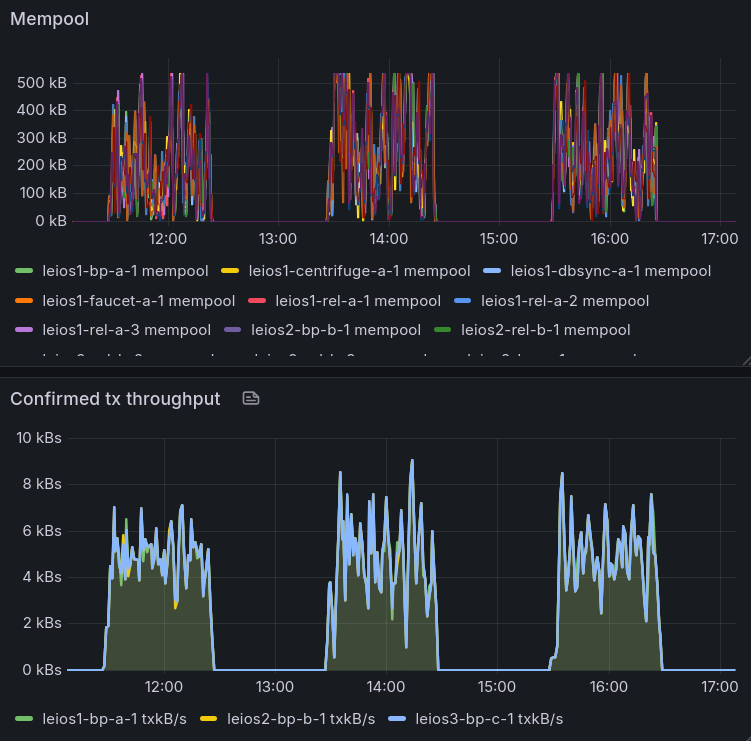
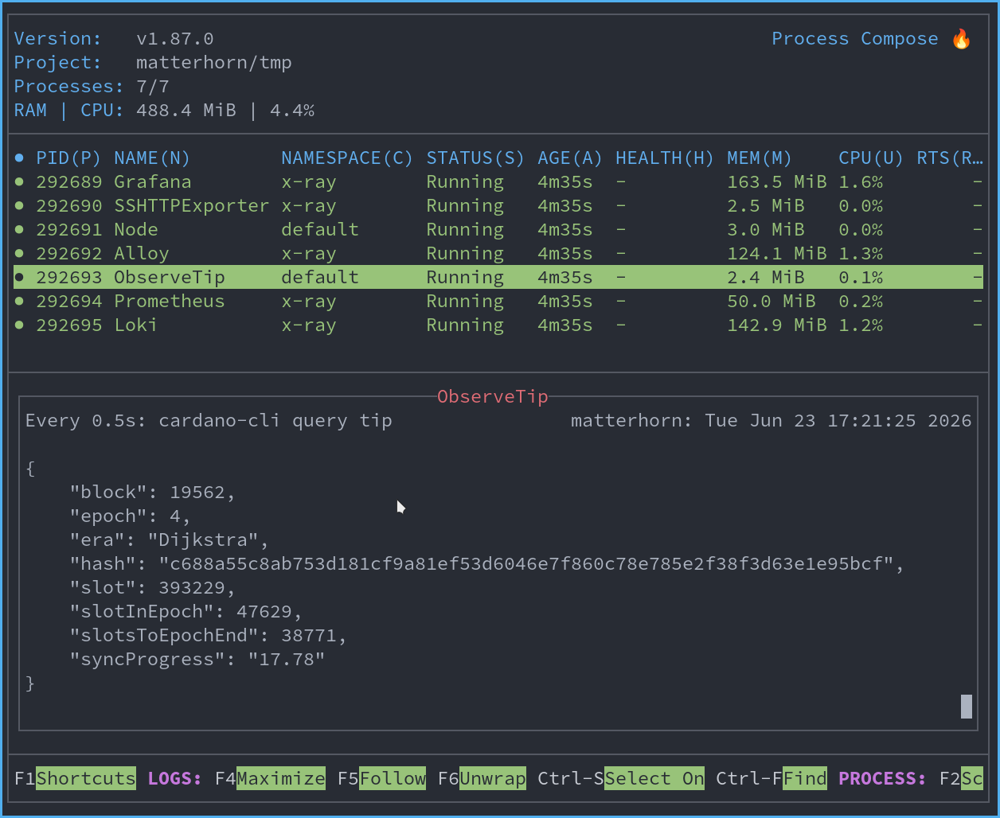
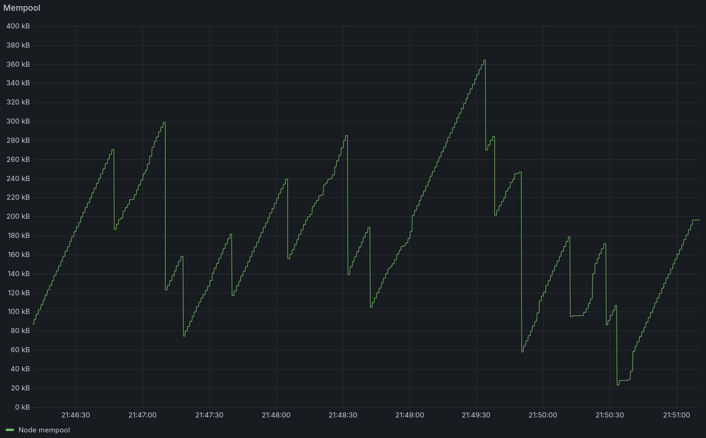

import Tabs from '@theme/Tabs';
import TabItem from '@theme/TabItem';

# Install and run a node

:::info Musashi Dōjō
Welcome to the **Musashi Dōjō**, the testnet and training hall for Ouroboros Leios.

The journey starts by learning to **install** and **run** a Leios node —
and, for the adventurous, how to **register a pool**.

The **Earth phase** — the first of the dojo's five phases of intense
experimentation, learning, and development — begins in July. Now is the
time to get familiar with this implementation.

Bring your questions to the dojo floor: join the
**[Musashi Dōjō Discord](https://discord.gg/Bx2qvsjCte)** for advice and
guidance when you hit a snag, and to raise any issues, concerns, or bugs
you find.
:::

## Where to start

1. **Install and run a node** (this page) — get a relay syncing against
   the testnet.
2. [Register a stake pool](./register-stake-pool.md) — become a block
   producer.

:::warning This is a prototype
The Leios testnet runs pre-release code that is rebuilt and redeployed
continuously. Expect the chain to be reset, the configuration to be
re-pinned, and these instructions to change constantly. Run it on
a throwaway machine or container, not on anything you rely on. Nothing
here touches mainnet or real ada.
:::

## What to expect in the early days

The testnet opens as a training ground, not a finished product. Expect
rough edges, especially at the start — that is the point of practicing in
the open. 

A rough picture of the early days:

- **Run nodes.** The first goal is simply a healthy population of nodes
  following the chain — relays, and a growing number of block producers.
  Standing one up (this guide) is the most useful thing you can do on day
  one.
- **Load comes from IO — and from you.** Leios only does its job under
  transaction load: endorser blocks get produced and certified when there
  is enough traffic to warrant them. IO drives a baseline with
  **tx-centrifuge** (an evolution of the transaction generator we have run
  on benchmark clusters for years), injecting transactions so Leios
  activates under realistic conditions.
- **Dapps are welcome.** Connect to the testnet and drive your own load —
  including script execution — to see how your workload behaves under
  Leios. Heads-up: not all tooling is **Dijkstra-era** ready yet, so
  some things may be missing or rough. It may not be a smooth start; that
  is expected.
- **Tool builders are welcome too.** If you maintain explorers, indexers,
  wallets, or SDKs, this is a good time to begin integrating with the
  Dijkstra era and the Leios testnet — start whenever you see fit. Early
  feedback is exactly what this phase is for.


<center>
Screenshot of the IO nodes processing an intermittent load. The initial load is ~2x of Praos capacity on a ~1 hour duty cycle.
</center>

:::tip Watch the chain
**[KleioScan](https://kleioscan.com/#/leios)** — an early Leios testnet
explorer built by [Kostas Dermentzis](https://github.com/kderme) — lets you watch blocks, including
endorser blocks, as they land.
:::

## The network at a glance

|                     |                                                                                                          |
|---------------------|----------------------------------------------------------------------------------------------------------|
| **Network**         | Ouroboros Leios public prototype testnet                                                                 |
| **Bootstrap relay** | `leios-node.play.dev.cardano.org:3001`                                                                   |
| **Network magic**   | `164`                                                                                                    |
| **Faucet**          | [faucet.leios.play.dev.cardano.org](https://faucet.leios.play.dev.cardano.org/basic-faucet)              |
| **Node release**    | [`prototype-2026w27`](https://github.com/input-output-hk/ouroboros-leios/releases/tag/prototype-2026w27) |
| **Node version**    | reports `cardano-node 11.1.0.164`                                                                        |

## System requirements

The network is fresh and will be respun every couple of weeks. Thus, the load on
validating nodes is light by testnet standards — a small machine is plenty, but
requires a reasonably fast disk:

|               |                                                    |
|---------------|----------------------------------------------------|
| **OS / arch** | Linux **x86-64** or macOS **aarch64** for prebuilt binaries |
| **CPU**       | 2 cores is fine; more only speeds the initial sync |
| **RAM**       | 4 GB comfortable (the node uses ~2–2.5 GB)         |
| **Disk**      | SSD, ~25 GB                                        |


:::info Requirements will change
Keep an eye out for these system requirements changing, especially the later
phases which will have more load and parameter exploration, which requires more
resources. In any case, we would like to [hear from your
experience](https://discord.gg/Bx2qvsjCte) running it on your individual
hardware or cloud provider.
:::

## Run a relay

You need a `cardano-node` (the Leios prototype) following the testnet as a
**relay**: a node that syncs the chain but does not produce blocks. Get
this stable before adding block-producer credentials in the
[next guide](./register-stake-pool.md).

A few ways to start one — pick whichever fits your setup:

- **Nix** — one command builds, installs, and runs the node together
  with a Grafana + Loki + Prometheus stack. Every dependency is
  provided.
- **Prebuilt binaries** — download the release tarball (Linux x86-64
  or macOS aarch64) and run with the repository's launch script.
  Compatible with the same observability stack if you install the
  extra tooling, or run the node on its own and bring your own tools.
- **Docker** — the same binaries packaged as a container image, for
  setups that already orchestrate nodes that way. No observability
  stack included.

Then continue to [Confirm you are syncing](#confirm-you-are-syncing).

### Nix

[Nix](https://nixos.org/download/) installs the node and all of its
dependencies reproducibly.

**1. Install Nix with flake support.** Any recent installer will do —
the [official installer](https://nixos.org/download/) or
[Determinate Systems'](https://determinate.systems/posts/determinate-nix-installer/)
both enable flakes out of the box. The first time you run a flake-based
command Nix will ask whether to accept its substituter settings — say
yes so the IOG binary cache from our flake kicks in. To skip the prompt
once and for all, add this to your nix.conf:

```
accept-flake-config = true
```

**2. Run the relay.** A single command runs a fully provisioned relay —
the node, a live tip-watcher, and the observability stack — with no clone
required:

```shell
nix run github:input-output-hk/ouroboros-leios#leios-testnet-relay
```

With the cache in play this should be **a few minutes** of downloads,
not hours of compilation.

<details>
<summary>If it starts compiling `cardano-node` from source</summary>

The flake-config trust didn't apply — usually because your user isn't
in `trusted-users` on a multi-user install, so the daemon ignores the
flake's substituter settings and falls back to no cache. Add the cache
to your global config and restart the daemon:

```shell
echo "extra-substituters = https://cache.iog.io" | sudo tee -a /etc/nix/nix.conf
echo "extra-trusted-public-keys = hydra.iohk.io:f/Ea+s+dFdN+3Y/G+FDgSq+a5NEWhJGzdjvKNGv0/EQ=" | sudo tee -a /etc/nix/nix.conf
sudo systemctl restart nix-daemon
```

The [IOG Nix setup guide](https://github.com/input-output-hk/iogx/blob/main/doc/nix-setup-guide.md)
covers the full configuration.

</details>

The node binds to `0.0.0.0:3010` and keeps its database, socket, and
log under `./tmp-testnet` in whatever directory you ran the command
from. Export that so the rest of this guide can refer to it generically:

```shell
export WORKING_DIR="$PWD/tmp-testnet"
```

A Grafana dashboard also opens at `http://localhost:3000` — see
[Out-of-the-box observability](#out-of-the-box-observability) for what
it gives you. Head to [Confirm you are syncing](#confirm-you-are-syncing).

:::tip Want the CLI on your PATH?
To use `cardano-node` and `cardano-cli` directly (for example, to register a
pool later), you may want to use this nix dev shell:

```shell
nix develop github:input-output-hk/ouroboros-leios#dev-testnet
cardano-node --version   # expect: cardano-node x.y.z.164
```
:::

### Prebuilt binaries

The release ships a tarball per platform with `cardano-node` and
`cardano-cli` under `bin/`. On Linux x86-64 the binaries are
statically linked; on macOS aarch64 the dylib paths are pre-rewritten
so they run on a stock macOS host. Either way, nothing else needs
installing.

**1. Pick a working directory.** Everything for this relay — binaries,
config, database, socket, log — lives here.

```shell
export WORKING_DIR=~/leios-testnet
mkdir -p "$WORKING_DIR"
```

**2. Download the release tarball and verify the checksum.**

<Tabs groupId="os">
<TabItem value="linux" label="Linux x86-64" default>

```shell
cd "$WORKING_DIR"

BASE=https://github.com/input-output-hk/ouroboros-leios/releases/download/prototype-2026w27
ARCHIVE=cardano-node-leios-x86_64-linux.tar.gz
CHECKSUM=cardano-node-leios-x86_64-linux.sha256
curl -L -O "$BASE/$ARCHIVE"
curl -L -O "$BASE/$CHECKSUM"
sha256sum -c "$CHECKSUM"
```

</TabItem>
<TabItem value="macos" label="macOS aarch64">

```shell
cd "$WORKING_DIR"

BASE=https://github.com/input-output-hk/ouroboros-leios/releases/download/prototype-2026w27
ARCHIVE=cardano-node-leios-aarch64-darwin.tar.gz
CHECKSUM=cardano-node-leios-aarch64-darwin.sha256
curl -L -O "$BASE/$ARCHIVE"
curl -L -O "$BASE/$CHECKSUM"
shasum -a 256 -c "$CHECKSUM"
```

</TabItem>
</Tabs>

You should see `cardano-node-leios-…tar.gz: OK`. If you see `FAILED`,
delete the files and download them again.

**3. Extract and put the binaries on your `PATH`.** The tarball
unpacks straight into `bin/`.

```shell
tar -xzf "$ARCHIVE"
export PATH="$WORKING_DIR/bin:$PATH"
```

Confirm `cardano-node --version` reports a version with `.164` suffix - this
marks the Leios prototype build.

**4. Get the testnet configuration.** Fetch the pin script and run it —
it downloads the `musashi` config (the node configuration
(`config.json`), topology (`topology.json`) that points at the public
bootstrap relays, and the era genesis files) from
[`book.play.dev.cardano.org`](https://book.play.dev.cardano.org/adv-musashi.html)
into `./config/`. Edit any of these locally if you want to experiment:

```shell
cd "$WORKING_DIR"
curl -LO https://raw.githubusercontent.com/input-output-hk/ouroboros-leios/main/testnet/pin-config.sh
bash pin-config.sh
```

**5. Start the relay.** Launch `cardano-node` as a non-producing relay,
bound to `0.0.0.0:3010`, with `$WORKING_DIR` holding its database,
socket, and log:

```shell
cd "$WORKING_DIR"
mkdir -p db
cardano-node run \
  --config config/config.json \
  --topology config/topology.json \
  --database-path db \
  --socket-path node.socket \
  --host-addr 0.0.0.0 \
  --port 3010 \
  2>&1 | tee -a node.log
```

Within a few seconds you will see the node connect to peers and begin
adding blocks (`AddedToCurrentChain`). The socket lands at
`$WORKING_DIR/node.socket` and the log at `$WORKING_DIR/node.log`.

:::tip Keep it running in the background
This runs in the foreground and streams log lines. To leave it running while you
work in the same terminal, start it under a terminal multiplexer such as `tmux`
or wrap it into a systemd service.
:::

### Docker

A prebuilt image carrying both `cardano-node` and `cardano-cli` is published for
each leios prototype release at
`ghcr.io/input-output-hk/ouroboros-leios/cardano-node-testnet:prototype-2026w27`
— useful if you already orchestrate nodes with containers. The image runs as a
non-block-producing relay out of the box; no observability stack is included.

Pick a host working directory, pull the pinned `musashi` config, and start the container mounting both:

```shell
export WORKING_DIR=~/leios-testnet
mkdir -p "$WORKING_DIR"
cd "$WORKING_DIR"

curl -LO https://raw.githubusercontent.com/input-output-hk/ouroboros-leios/main/testnet/pin-config.sh
bash pin-config.sh

docker run -d --name leios-relay \
  -p 3010:3010 \
  -v "$WORKING_DIR:/data" \
  -v "$WORKING_DIR/config:/app/config:ro" \
  ghcr.io/input-output-hk/ouroboros-leios/cardano-node-testnet:prototype-2026w27
```

The `$WORKING_DIR` mount keeps the database, socket (`$WORKING_DIR/node.socket`),
and log on the host across container restarts. The image also ships a pinned
copy of the same config inside, so the `-v $WORKING_DIR/config:/app/config:ro`
mount is optional — drop it to fall back to the in-image snapshot.

Follow the running container with `docker logs -f leios-relay`.

## Confirm you are syncing

On the **Nix** path the relay's process dashboard already shows live sync in its
tip-watcher pane:


<center>
A leios-enabled cardano-node syncing the Musashi network
</center>

To query the node yourself, open a **second terminal** with `cardano-cli` and
`$WORKING_DIR` available, point it at the node's socket, and ask for the chain
tip:

```shell
export CARDANO_NODE_NETWORK_ID=164
export CARDANO_NODE_SOCKET_PATH="$WORKING_DIR/node.socket"
cardano-cli query tip
```

You will see something like:

```json
{
    "block": 48521,
    "epoch": 11,
    "era": "Dijkstra",
    "slot": 969905,
    "syncProgress": "46.36"
}
```

Run it again every minute — `block`, `slot`, and `syncProgress` should
climb. When `syncProgress` reads `100.00`, your node is fully caught up
and following the testnet.

:::warning Sync is slow in the early days — be patient
Catching up through the transaction-heavy part of the chain is slow
right now. Two things make it worse in this phase of the testnet:

- **Few relays serving blocks.** The network is small and sync depends
  on a handful of peers having the blocks you need. If none of your
  upstreams have them, the node will sit and wait — sometimes for many
  minutes — before progress resumes.
- **Catch-up isn't optimized yet.** A more efficient catch-up path is
  on the roadmap; until it lands, expect long pauses and bursty
  progress where `syncProgress` and the block height sit still, then
  jump forward.

Your node may also get **genuinely stuck**. If that happens, give it a
while, then try again later when more relays are around. Restarting is
fine — it costs the small amount of unwritten state, not the synced
chain on disk.

If you keep hitting a wall, please reach out on the
**[Musashi Dōjō Discord](https://discord.gg/Bx2qvsjCte)** — that's
exactly the feedback the onboarding phase is here to surface.
:::

## Out-of-the-box observability

The Nix path boots a Grafana + Loki + Prometheus stack alongside the
node, so you can watch sync progress, peer activity, and Leios events
without setting anything up. Grafana opens at `http://localhost:3000`
and gives you:

- a process dashboard showing the node and the tip-watcher (live sync
  progress) side by side
- Loki-backed log search, so you can filter for Leios events through
  the UI rather than tailing files
- Prometheus metrics for resource usage, mempool depth, and chain tip

The **Prebuilt binaries** and **Docker** paths bring only the node
itself; observability there is whatever you wire up around it. If you
want the same wrapped experience without going all-in on Nix, clone the
repository and run its
[`testnet/run.sh`](https://github.com/input-output-hk/ouroboros-leios/blob/prototype-2026w27/testnet/run.sh)
— a `process-compose` script that boots the node together with Grafana
+ Loki + Prometheus. It needs `process-compose`, `envsubst`, Grafana,
Loki, and Prometheus on your `PATH`, all of which the `dev-testnet` Nix
dev shell supplies.

## What to look for

The pinned configuration turns on debug tracing for the Leios
subsystems, so you can watch endorser blocks move through your node —
either through Loki/Grafana, or by tailing `$WORKING_DIR/node.log`
directly:

```shell
tail -f "$WORKING_DIR/node.log" | grep -E 'Leios|CertRB'
```

Greppable highlights:

- `"kind":"LeiosBlockForged"` / `"kind":"LeiosBlockCertified"` — an
  endorser block being produced and certified (emitted by block
  producers; at a relay you see the offers arrive).
- `"kind":"LeiosBlockAcquired"` / `"kind":"LeiosBlockTxsAcquired"` — an
  endorser-block body or its transaction closure arriving from a peer.
- `"kind":"CertRBStaged"` / `"kind":"CertRBReleased"` — a ranking block
  held back until its endorser-block closure is local, then released
  once it arrives.

If you have the [out-of-the-box grafana dashboard](http://localhost:3000/d/gg7w7r/proto-devnet-throughput?orgId=1&from=now-5m&to=now&timezone=browser&refresh=5s&viewPanel=panel-1) or other means to watch the current mempool size, you can see Leios in action:


<center>
Mempool depleting under load: small spikes down = normal Praos blocks, bigger spikes = Leios EBs via RBs
</center>

Seeing these flow through a node you stood up yourself is the protocol behaving
in public exactly as the design intends.
